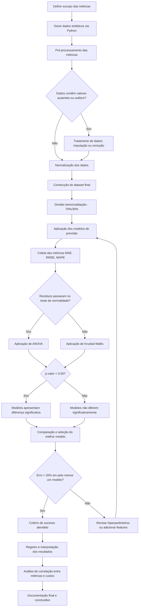

# Plano de Experimento – Previsão de Custos de Infraestrutura Cloud

---

## 1. Identificação Básica

### 1.1 Título do Experimento
**Previsão de Custos de Infraestrutura Cloud Utilizando Modelos Baseados em Métricas Reais: Uma Comparação entre Algoritmos Simples e Técnicas de Séries Temporais**

### 1.2 ID / Código
`TCC-PRED-CUSTO-2024-001`

### 1.3 Versão do Documento e Histórico de Revisão

| Versão | Data | Autor | Descrição das Alterações |
|--------|------|-------|--------------------------|
| v1.0 | 02/12/2024 | Renato Matos Alves Penna | Versão inicial - Seções 1 a 4 |

### 1.4 Datas

- **Data de Criação:** 02/12/2024
- **Última Atualização:** 02/12/2024

### 1.5 Autores

| Nome | Área | Contato |
|------|------|---------|
| Renato Matos Alves Penna | Computação / Engenharia de Software | renatomatosapbusiness@gmail.com |

### 1.6 Responsável Principal (PI / Dono do Experimento)

**Orientador:** Danilo de Quadros Maia Filho  
**Responsável pela Execução:** Renato Matos Alves Penna

### 1.7 Projeto / Produto / Iniciativa Relacionada

Este experimento está vinculado ao **Trabalho de Conclusão de Curso (TCC)** do curso de graduação, com foco em Engenharia de Software Experimental aplicada a Cloud Computing. O estudo visa contribuir tanto para o contexto acadêmico quanto para aplicações práticas em empresas e startups que buscam otimização de custos em infraestrutura cloud.

---

## 2. Contexto e Problema

### 2.1 Descrição do Problema / Oportunidade

A computação em nuvem tornou-se fundamental para organizações modernas, permitindo escalabilidade sob demanda e redução de custos de infraestrutura física. Entretanto, a natureza dinâmica e elástica dos recursos cloud apresenta um desafio crítico: **custos imprevisíveis e difíceis de estimar**.

#### Problema Central:
Organizações frequentemente enfrentam:
- **Gastos inesperados** devido a picos de uso não antecipados
- **Dificuldade em prever orçamentos** mensais/trimestrais de infraestrutura
- **Falta de visibilidade** sobre quais métricas de uso mais impactam os custos
- **Ausência de modelos preditivos** que auxiliem no planejamento financeiro

#### Oportunidade:
Criar modelos de previsão de custos baseados em métricas reais de uso (CPU, memória, armazenamento, requisições) pode:
- Permitir **planejamento financeiro mais preciso**
- Identificar **padrões de consumo** e oportunidades de otimização
- Auxiliar **decisões técnicas** com impacto financeiro quantificável
- Prevenir **estouros de orçamento** através de alertas antecipados

### 2.2 Contexto Organizacional e Técnico

#### Contexto Organizacional:
Este é um **experimento acadêmico** desenvolvido como Trabalho de Conclusão de Curso. Embora não esteja vinculado a uma empresa específica, o estudo foi projetado para ter **aplicabilidade prática** em contextos reais de:
- Startups e PMEs que utilizam infraestrutura cloud
- Times de DevOps responsáveis por otimização de custos
- Equipes de engenharia que precisam justificar decisões técnicas financeiramente
- Departamentos financeiros que necessitam de previsões orçamentárias confiáveis

#### Contexto Técnico:
- **Ambiente:** Simulação baseada em padrões realísticos de workloads cloud
- **Tecnologias:** Python 3.10+, bibliotecas de análise de dados (Pandas, NumPy), machine learning (Scikit-learn, Statsmodels, Prophet)
- **Métricas analisadas:** CPU, memória RAM, armazenamento, volume de requisições/tráfego de rede
- **Modelos cloud:** Precificação baseada em provedores reais (AWS, Azure, GCP)
- **Processo:** Metodologia experimental controlada com análise estatística rigorosa

### 2.3 Trabalhos e Evidências Prévias (Internos e Externos)

#### Evidências Externas (Literatura):
**Nota:** Esta seção será expandida na fase de revisão bibliográfica, mas alguns temas relevantes incluem:
- Estudos sobre **time series forecasting** aplicados a custos de TI
- Papers sobre **cloud cost optimization** e FinOps
- Pesquisas comparando **modelos de previsão** (ARIMA, exponential smoothing, machine learning)
- Trabalhos sobre **métricas de infraestrutura** como preditores de custos

#### Evidências Internas:
Este é o primeiro experimento formal sobre o tema no contexto do TCC. Observações preliminares indicam que:
- Modelos de séries temporais podem capturar padrões sazonais de uso
- Métricas de CPU e requisições apresentam correlação forte com custos
- A granularidade dos dados (diária vs. horária) afeta a precisão das previsões

### 2.4 Referencial Teórico e Empírico Essencial

#### Conceitos Fundamentais:

**1. Computação em Nuvem e Modelos de Precificação:**
- Recursos elásticos e precificação baseada em uso
- Métricas de consumo: CPU, memória, armazenamento, rede
- Modelos pay-as-you-go dos principais provedores

**2. Séries Temporais:**
- Conceitos de tendência, sazonalidade e ruído
- Estacionariedade e transformações necessárias
- Autocorrelação e dependência temporal

**3. Modelos de Previsão:**
- **Modelos Simples:** Média móvel, regressão linear
- **Modelos Clássicos de Séries Temporais:** ARIMA, Exponential Smoothing
- **Métricas de Avaliação:** MAE, RMSE, MAPE

**4. Engenharia de Software Experimental:**
- Desenho experimental e controle de variáveis
- Testes de hipóteses e análise estatística
- Validação cruzada e generalização de modelos

#### Base Empírica:
A literatura em FinOps e cloud cost management demonstra que:
- Previsões precisas reduzem desperdício em até 30%
- Modelos baseados em séries temporais superam heurísticas simples
- A combinação de múltiplas métricas melhora a acurácia preditiva

---

## 3. Objetivos e Questões (Goal / Question / Metric)

### 3.1 Objetivo Geral (Goal Template)

**Analisar** modelos de previsão de custos cloud baseados em métricas reais de uso  
**com o propósito de** comparar sua acurácia e identificar qual apresenta melhor desempenho  
**com respeito a** erro de previsão (MAE, RMSE, MAPE) e capacidade de generalização  
**do ponto de vista de** engenheiros de software, times de DevOps e gestores financeiros  
**no contexto de** ambientes cloud com workloads simulados representando aplicações reais.

### 3.2 Objetivos Específicos

1. **O1 - Desenvolver modelos de previsão:** Construir e implementar pelo menos quatro modelos distintos de previsão de custos (regressão linear, média móvel, ARIMA, exponential smoothing) utilizando métricas reais de uso de infraestrutura.

2. **O2 - Avaliar acurácia dos modelos:** Medir e comparar a precisão de cada modelo utilizando métricas padronizadas de erro (MAE, RMSE, MAPE) em diferentes janelas temporais.

3. **O3 - Identificar variáveis preditoras:** Analisar quais métricas de infraestrutura (CPU, memória, requisições, armazenamento) apresentam maior correlação com os custos finais e maior poder preditivo.

4. **O4 - Validar generalização:** Verificar se os modelos mantêm precisão adequada em dados não utilizados no treinamento (validação cruzada), garantindo capacidade de generalização para períodos futuros.

5. **O5 - Comparar estabilidade:** Avaliar a robustez dos modelos diante de diferentes padrões de uso (picos, sazonalidade, tendências) e determinar qual apresenta previsões mais estáveis.

### 3.3 Questões de Pesquisa / de Negócio

#### Relacionadas ao Objetivo O1 (Desenvolver modelos):
- **Q1.1:** Qual modelo de previsão apresenta o menor erro médio absoluto (MAE)?
- **Q1.2:** Como os modelos se comportam em diferentes janelas de previsão (7, 14 e 30 dias)?
- **Q1.3:** Existe diferença estatisticamente significativa entre o desempenho dos modelos?

#### Relacionadas ao Objetivo O2 (Avaliar acurácia):
- **Q2.1:** Qual modelo apresenta menor erro quadrático médio (RMSE)?
- **Q2.2:** Qual modelo oferece o menor erro percentual (MAPE)?
- **Q2.3:** Os erros de previsão diminuem com janelas temporais maiores?

#### Relacionadas ao Objetivo O3 (Identificar variáveis):
- **Q3.1:** Quais métricas de infraestrutura apresentam maior correlação com os custos totais?
- **Q3.2:** Como variações no volume de requisições afetam o custo previsto?
- **Q3.3:** O consumo de CPU é um preditor melhor que o uso de memória para custos?

#### Relacionadas ao Objetivo O4 (Validar generalização):
- **Q4.1:** Os modelos generalizam bem para períodos não vistos durante o treinamento?
- **Q4.2:** Qual é o erro médio de validação cruzada de cada modelo?
- **Q4.3:** Existe degradação significativa de performance entre treino e teste?

#### Relacionadas ao Objetivo O5 (Comparar estabilidade):
- **Q5.1:** Qual modelo apresenta menor variância nos erros de previsão?
- **Q5.2:** Algum modelo apresenta sinais de overfitting (diferença treino/teste > 10%)?
- **Q5.3:** Os modelos de séries temporais são mais estáveis que modelos simples?

### 3.4 Métricas Associadas (GQM)

#### Tabela GQM Completa

| Objetivo | Questão | Métricas Associadas |
|----------|---------|---------------------|
| **O1: Desenvolver modelos** | Q1.1: Qual modelo apresenta menor MAE? | M1 (MAE) |
| | Q1.2: Como se comportam em diferentes janelas? | M1 (MAE), M2 (RMSE) |
| | Q1.3: Há diferença estatística entre modelos? | M1 (MAE), M11 (p-valor ANOVA) |
| **O2: Avaliar acurácia** | Q2.1: Qual modelo apresenta menor RMSE? | M2 (RMSE) |
| | Q2.2: Qual modelo oferece menor MAPE? | M3 (MAPE) |
| | Q2.3: Erros diminuem com janelas maiores? | M1 (MAE), M2 (RMSE) por janela |
| **O3: Identificar variáveis** | Q3.1: Quais métricas têm maior correlação? | M4 (Correlação %), M7-M10 |
| | Q3.2: Como requisições afetam custo? | M5 (Custo/requisição), M10 (Requisições) |
| | Q3.3: CPU vs. Memória como preditor? | M4 (Correlação), M7 (CPU), M8 (Memória) |
| **O4: Validar generalização** | Q4.1: Modelos generalizam para novos períodos? | M6 (Erro validação cruzada) |
| | Q4.2: Qual erro médio de validação cruzada? | M6 (Erro validação cruzada) |
| | Q4.3: Há degradação entre treino/teste? | M12 (Diferença treino/teste) |
| **O5: Comparar estabilidade** | Q5.1: Qual modelo tem menor variância? | M13 (Desvio padrão dos erros) |
| | Q5.2: Algum modelo apresenta overfitting? | M12 (Diferença treino/teste) |
| | Q5.3: Séries temporais são mais estáveis? | M13 (Desvio padrão), M12 (Diferença treino/teste) |

#### Tabela Detalhada de Métricas

| ID | Métrica | Descrição Completa | Unidade | Fonte dos Dados |
|----|---------|-------------------|---------|-----------------|
| **M1** | MAE (Mean Absolute Error) | Erro absoluto médio entre valores reais e previstos | Valor monetário (R$) | Cálculo pós-previsão |
| **M2** | RMSE (Root Mean Square Error) | Raiz quadrada do erro quadrático médio | Valor monetário (R$) | Cálculo pós-previsão |
| **M3** | MAPE (Mean Absolute Percentage Error) | Erro percentual absoluto médio | Percentual (%) | Cálculo pós-previsão |
| **M4** | Correlação com Custo | Correlação de Pearson entre métrica e custo final | Coeficiente (-1 a 1) | Análise estatística |
| **M5** | Custo por Requisição | Custo médio por requisição processada | R$ por requisição | Dataset de custos |
| **M6** | Erro de Validação Cruzada | Erro médio em k-fold cross-validation (k=5) | Percentual (%) | Validação cruzada |
| **M7** | Consumo Médio de CPU | Utilização percentual média de CPU | Percentual (%) | Métricas simuladas |
| **M8** | Consumo Médio de Memória | Uso médio de memória RAM | Megabytes (MB) | Métricas simuladas |
| **M9** | Volume de Armazenamento | Quantidade total de storage utilizado | Gigabytes (GB) | Métricas simuladas |
| **M10** | Quantidade de Requisições | Volume de requisições por período | Requisições/segundo | Métricas simuladas |
| **M11** | P-valor (ANOVA/Kruskal-Wallis) | Significância estatística da diferença entre modelos | Valor p | Teste estatístico |
| **M12** | Diferença Treino/Teste | Diferença percentual de erro entre treino e teste | Percentual (%) | Comparação de erros |
| **M13** | Desvio Padrão dos Erros | Variabilidade dos erros de previsão | Valor monetário (R$) | Análise estatística |

---

## 4. Escopo e Contexto do Experimento

### 4.1 Escopo Funcional / de Processo (Incluído e Excluído)

#### ✅ Incluído no Escopo:

**Métricas de Infraestrutura:**
- Consumo de CPU (percentual de utilização)
- Consumo de memória RAM (em MB)
- Volume de armazenamento (em GB)
- Quantidade de requisições/tráfego de rede (req/s)

**Modelos de Previsão:**
- Regressão Linear
- Média Móvel Simples
- ARIMA (AutoRegressive Integrated Moving Average)
- Exponential Smoothing (Suavização Exponencial)

**Janelas Temporais de Análise:**
- Previsões baseadas em 7 dias
- Previsões baseadas em 14 dias
- Previsões baseadas em 30 dias

**Métricas de Avaliação:**
- MAE, RMSE, MAPE
- Erro de validação cruzada (k=5)
- Análise de correlação entre métricas e custos
- Testes estatísticos (ANOVA ou Kruskal-Wallis)

**Análises:**
- Comparação estatística entre modelos
- Identificação de variáveis mais preditivas
- Análise de estabilidade e generalização
- Detecção de overfitting

#### ❌ Excluído do Escopo:

**Aspectos Técnicos:**
- Implementação em ambiente cloud real (será simulado)
- Integração com APIs de provedores cloud
- Monitoramento em tempo real
- Sistemas de alertas automáticos
- Deploy de modelos em produção

**Métricas Adicionais:**
- Custos de transferência de dados entre regiões
- Custos de serviços gerenciados (bancos de dados, cache)
- Custos de suporte técnico ou SLAs
- Métricas de latência ou disponibilidade

**Modelos Avançados:**
- Redes neurais ou deep learning
- Modelos ensemble complexos
- Prophet (Facebook) ou técnicas de boosting
- Modelos específicos de provedores (AWS Forecast, etc.)

**Aspectos Organizacionais:**
- Análise de ROI ou business case
- Processos de governança financeira
- Políticas de chargeback entre departamentos
- Compliance ou auditoria financeira

### 4.2 Contexto do Estudo (Tipo de Organização, Projeto, Experiência)

#### Tipo de Organização:
**Contexto Acadêmico** - Trabalho de Conclusão de Curso  
Embora seja um estudo acadêmico, foi projetado para ter **aplicabilidade prática** em:
- Startups de tecnologia
- Pequenas e médias empresas (PMEs) com infraestrutura cloud
- Times de DevOps em organizações de qualquer porte

#### Tipo de Projeto:
- **Natureza:** Experimento controlado com análise quantitativa
- **Duração:** 5 meses (planejamento e execução)
- **Complexidade:** Média (4 modelos, 3 janelas temporais, múltiplas métricas)

#### Perfil de Experiência:
- **Pesquisador:** Estudante de graduação com conhecimento intermediário em:
  - Engenharia de Software
  - Análise de dados e estatística
  - Cloud computing (conceitual)
  - Python e bibliotecas de machine learning

#### Criticidade:
- **Baixa criticidade operacional** (ambiente simulado)
- **Alta criticidade acadêmica** (requisito de TCC)
- **Potencial impacto prático** médio-alto para empresas que adotarem os resultados

### 4.3 Premissas

1. **Dados de Uso:**
   - É possível obter e processar dados reais de traces públicos de cloud computing
   - Os traces do Google Cluster Data 2019 são representativos de workloads cloud reais
   - A granularidade dos dados (5 minutos para 1 hora após agregação) é suficiente para capturar padrões relevantes

2. **Período Analisado:**
   - 30 dias de histórico do dataset são suficientes para treinamento
   - O período extraído representa comportamento típico de sistemas cloud
   - Não há eventos extraordinários no período específico selecionado que distorçam completamente os padrões

3. **Cálculo de Custos:**
   - As tabelas de precificação dos provedores permanecem estáveis durante o período
   - É possível estimar custos baseando-se em tabelas públicas (AWS, Azure, GCP)
   - A conversão de métricas de uso (CPU, memória) em custo monetário segue modelo linear simplificado

4. **Modelos de Previsão:**
   - Os modelos escolhidos são representativos das abordagens mais comuns
   - As implementações das bibliotecas (Scikit-learn, Statsmodels) são confiáveis
   - Hiperparâmetros padrão são adequados para uma primeira comparação

5. **Recursos Computacionais:**
   - O hardware disponível é suficiente para processar o dataset e treinar os modelos em tempo hábil
   - Python 3.10+ e bibliotecas necessárias estão disponíveis e funcionais
   - Dataset do Kaggle (sample) é acessível e tem tamanho gerenciável

6. **Conhecimento Técnico:**
   - O pesquisador possui conhecimento suficiente para implementar os modelos
   - Há suporte do orientador para decisões metodológicas críticas
   - Documentação do Google Cluster Data é suficiente para interpretar os dados corretamente

### 4.4 Restrições

1. **Temporais:**
   - Prazo de 5 meses para conclusão (incluindo documentação)
   - Necessidade de cumprir datas de entrega intermediárias (entregas 1-4)

2. **Financeiras:**
   - Orçamento zero (uso de ferramentas gratuitas/open-source apenas)
   - Uso de datasets públicos gratuitos (Google Cluster Data via Kaggle ou BigQuery free tier)

3. **Técnicas:**
   - Limitação a modelos implementáveis com bibliotecas Python gratuitas
   - Dependência de dados de traces públicos (contexto específico do Google)
   - Processamento local (sem clusters ou infraestrutura distribuída)
   - Necessidade de agregar/processar dados brutos do trace

4. **Metodológicas:**
   - Desenho experimental com fator único (tipo de modelo)
   - Dataset fixo (período específico de maio 2019)
   - Foco em análise quantitativa (sem entrevistas ou estudos de caso)

5. **Organizacionais:**
   - Projeto individual (sem equipe de desenvolvimento)
   - Dependência da disponibilidade do orientador para revisões

6. **Escopo:**
   - Limitação a 4 modelos de previsão (questão de viabilidade)
   - Apenas métricas de CPU e memória do dataset (storage/rede são estimados ou ausentes)
   - Dataset específico de um provedor (Google), não multi-cloud

### 4.5 Limitações Previstas

#### Limitações de Validade Externa (Generalização):

1. **Contexto Específico do Dataset:**
   - Dados provenientes exclusivamente de clusters Google (não AWS, Azure, outros)
   - Workloads específicos do Google (podem não representar todas as empresas)
   - Período específico (maio 2019) pode não capturar sazonalidades anuais
   - Diferentes provedores cloud têm características diferentes

2. **Precificação Estimada:**
   - Custos calculados com tabelas públicas, não refletem custos reais Google
   - Não considera descontos corporativos, reserved instances ou savings plans
   - Modelo de precificação simplificado (linear) pode não capturar complexidades reais

3. **Escala e Complexidade:**
   - Dataset de larga escala pode ter características diferentes de PMEs
   - Múltiplos serviços e interdependências do Google não são replicáveis em empresas menores
   - Padrões de uso de um hyperscaler podem não se aplicar a todos os contextos

#### Limitações de Validade Interna:

1. **Variáveis de Confusão:**
   - Possível correlação espúria entre métricas devido à simulação
   - Dificuldade em isolar completamente o efeito de cada variável

2. **Vieses de Implementação:**
   - Escolha de hiperparâmetros pode favorecer alguns modelos
   - Qualidade da implementação pode variar entre modelos

#### Limitações de Validade de Constructo:

1. **Medição de Custos:**
   - Custos simulados podem não refletir descontos, reserved instances ou savings plans
   - Variações de preço por região não são consideradas

2. **Complexidade Reduzida:**
   - Métricas de infraestrutura são simplificação da realidade
   - Fatores humanos e organizacionais não são capturados

#### Limitações Práticas:

1. **Recursos Limitados:**
   - Tempo e capacidade computacional limitam a complexidade dos modelos
   - Impossibilidade de testar todos os modelos e configurações possíveis

2. **Experiência:**
   - Primeira experiência formal com experimentação controlada
   - Curva de aprendizado pode afetar qualidade inicial

**Estratégias de Mitigação:** Estas limitações serão reconhecidas explicitamente nos resultados e discussão do trabalho, com recomendações claras sobre contextos onde os resultados são mais ou menos aplicáveis.

---

## 5. Stakeholders e Impacto Esperado

### 5.1 Stakeholders Principais

| Stakeholder | Papel | Interesse no Experimento |
|-------------|-------|--------------------------|
| **Empresas e Startups** | Tomadores de decisão financeira | Modelos que ajudem a prever e controlar custos cloud |
| **Times DevOps** | Operadores de infraestrutura | Ferramentas para planejamento de escalabilidade e otimização de recursos |
| **Desenvolvedores** | Criadores de aplicações | Entendimento do impacto financeiro de decisões técnicas (arquitetura, padrões de uso) |
| **Times Financeiros** | Gestores de orçamento | Previsões mais confiáveis para planejamento orçamentário |
| **Gestores de TI** | Liderança técnica | Dados para justificar investimentos e decisões estratégicas |
| **Orientador Acadêmico** | Supervisor do TCC | Qualidade metodológica e rigor científico do experimento |
| **Comunidade Acadêmica** | Pesquisadores | Contribuição para área de Engenharia de Software Experimental e FinOps |

### 5.2 Interesses e Expectativas dos Stakeholders

#### Empresas e Startups:
- **Expectativa:** Identificar modelo de previsão aplicável na prática
- **Interesse:** Reduzir gastos inesperados em até 15-30%
- **Utilidade:** Implementar alertas preditivos de estouro de orçamento
- **Benefício:** ROI positivo através de melhor planejamento financeiro

#### Times DevOps:
- **Expectativa:** Compreender quais métricas monitorar prioritariamente
- **Interesse:** Correlação clara entre métricas técnicas e impacto financeiro
- **Utilidade:** Dados para dimensionar infraestrutura preventivamente
- **Benefício:** Redução de incidentes relacionados a recursos (out of memory, throttling)

#### Desenvolvedores:
- **Expectativa:** Entender como decisões de código/arquitetura afetam custos
- **Interesse:** Modelos que relacionem padrões de uso com custos específicos
- **Utilidade:** Guidelines para desenvolvimento cost-aware
- **Benefício:** Código mais eficiente e econômico

#### Times Financeiros:
- **Expectativa:** Previsões confiáveis para orçamentos trimestrais/anuais
- **Interesse:** Erro de previsão < 20%
- **Utilidade:** Justificativas quantitativas para alocação de recursos
- **Benefício:** Redução de ajustes orçamentários emergenciais

#### Gestores de TI:
- **Expectativa:** Evidências para tomada de decisão estratégica
- **Interesse:** Comparação objetiva entre diferentes abordagens preditivas
- **Utilidade:** Business case para investimento em ferramentas de FinOps
- **Benefício:** Melhor governança de custos cloud

#### Orientador e Comunidade Acadêmica:
- **Expectativa:** Experimento metodologicamente rigoroso
- **Interesse:** Contribuição científica para área de Engenharia de Software Experimental
- **Utilidade:** Referência para futuros trabalhos em FinOps e previsão de custos
- **Benefício:** Avanço do conhecimento na interseção de ES e cloud computing

### 5.3 Impactos Potenciais no Processo / Produto

#### Durante a Execução do Experimento:

**Impactos Positivos:**
- **Aprendizado:** Ganho de conhecimento em técnicas de séries temporais e análise preditiva
- **Metodologia:** Experiência prática com experimentação controlada
- **Documentação:** Criação de material de referência sobre previsão de custos cloud

**Impactos Neutros:**
- **Tempo:** Dedicação de ~5 meses ao experimento (esperado para TCC)
- **Recursos:** Uso de recursos computacionais locais (sem custo adicional)

**Impactos Negativos (Mitigados):**
- **Risco mínimo:** Por ser simulação, não há risco de impactar sistemas em produção
- **Escopo limitado:** Foco em dados sintéticos pode gerar expectativas não atendidas

#### Pós-Experimento:

**Impacto Acadêmico:**
- Contribuição para corpus de conhecimento em FinOps
- Possível publicação em workshops ou conferências de ES
- Referência para trabalhos futuros sobre cloud cost optimization

**Impacto Prático:**
- Empresas podem implementar modelos testados
- Redução de desperdício financeiro em infraestrutura cloud
- Melhoria em processos de planejamento e governança

**Impacto no Produto/Processo:**
- **Curto prazo:** Não há produto direto, mas documentação e código reutilizáveis
- **Médio prazo:** Potencial de evolução para ferramenta de previsão
- **Longo prazo:** Base para sistema de FinOps completo (alertas, dashboards, recomendações)

---

## 6. Riscos de Alto Nível, Premissas e Critérios de Sucesso

### 6.1 Riscos de Alto Nível (Negócio, Técnicos, etc.)

#### Riscos de Negócio:

| Risco | Probabilidade | Impacto | Mitigação |
|-------|---------------|---------|-----------|
| **Resultados não aplicáveis na prática** | Média | Alto | Usar dataset real (Google Cluster Data); validar com literatura |
| **Baixo interesse de stakeholders** | Baixa | Médio | Demonstrar aplicabilidade através de casos de uso concretos |
| **Expectativas não atendidas** | Média | Médio | Comunicar claramente escopo e limitações desde o início |

#### Riscos Técnicos:

| Risco | Probabilidade | Impacto | Mitigação |
|-------|---------------|---------|-----------|
| **Dados reais com problemas de qualidade** | Média | Alto | Pré-validação rigorosa; tratamento de outliers e valores faltantes |
| **Modelos com baixo poder preditivo** | Média | Alto | Testar múltiplos modelos; ajustar hiperparâmetros se necessário |
| **Problemas de implementação** | Baixa | Médio | Usar bibliotecas consolidadas (Scikit-learn, Statsmodels) |
| **Hardware insuficiente para processar dataset** | Média | Médio | Usar sample do Kaggle (gerenciável) ao invés do dataset completo |
| **Bugs ou erros de código** | Média | Médio | Testes unitários; revisão de código; validação de resultados |

#### Riscos de Dados:

| Risco | Probabilidade | Impacto | Mitigação |
|-------|---------------|---------|-----------|
| **Dataset indisponível ou alterado** | Baixa | Alto | Fazer download e backup local; usar múltiplas fontes (Kaggle + BigQuery) |
| **Inconsistência no período analisado** | Baixa | Médio | Validação de qualidade dos dados extraídos; análise exploratória |
| **Falta de variabilidade nos dados** | Baixa | Médio | Google Cluster Data tem alta variabilidade natural de workloads reais |

#### Riscos Metodológicos:

| Risco | Probabilidade | Impacto | Mitigação |
|-------|---------------|---------|-----------|
| **Viés na comparação de modelos** | Média | Alto | Usar mesma métrica de avaliação e mesmo dataset para todos |
| **Overfitting não detectado** | Média | Alto | Validação cruzada rigorosa; análise de diferença treino/teste |
| **Falta de significância estatística** | Média | Alto | Garantir tamanho de amostra adequado (30 execuções por modelo) |

#### Riscos de Cronograma:

| Risco | Probabilidade | Impacto | Mitigação |
|-------|---------------|---------|-----------|
| **Atrasos na implementação** | Média | Alto | Buffer de tempo no cronograma; entregas incrementais |
| **Complexidade subestimada** | Média | Médio | Revisão periódica do progresso com orientador |
| **Problemas pessoais/saúde** | Baixa | Alto | Adiantar entregas quando possível; comunicação transparente |

#### Riscos Externos:

| Risco | Probabilidade | Impacto | Mitigação |
|-------|---------------|---------|-----------|
| **Mudanças em precificação de provedores** | Baixa | Baixo | Usar tabelas de preço fixas do momento inicial |
| **Indisponibilidade do orientador** | Baixa | Médio | Agendar reuniões com antecedência; documentar decisões |

### 6.2 Critérios de Sucesso Globais (Go / No-Go)

#### Critérios Mínimos de Sucesso (Must-Have):

✅ **Critério 1: Modelos Funcionais**
- **Meta:** Implementar com sucesso pelo menos 3 dos 4 modelos propostos
- **Medida:** Código executável que gera previsões
- **Limiar:** 100% dos modelos rodando sem erros críticos

✅ **Critério 2: Avaliação de Acurácia**
- **Meta:** Calcular MAE, RMSE e MAPE para todos os modelos
- **Medida:** Métricas de erro computadas e documentadas
- **Limiar:** Todas as métricas calculadas para todos os modelos

✅ **Critério 3: Comparação Estatística**
- **Meta:** Realizar teste estatístico comparando desempenho dos modelos
- **Medida:** ANOVA ou Kruskal-Wallis com p-valor calculado
- **Limiar:** Teste realizado com interpretação clara dos resultados

✅ **Critério 4: Identificação de Melhor Modelo**
- **Meta:** Determinar qual modelo apresenta menor erro
- **Medida:** Ranking dos modelos por MAE
- **Limiar:** Conclusão clara sobre qual modelo é superior

#### Critérios Desejáveis de Sucesso (Should-Have):

🎯 **Critério 5: Erro Aceitável**
- **Meta:** Atingir erro médio < 20% em ao menos um modelo
- **Medida:** MAPE do melhor modelo
- **Limiar:** MAPE < 20% (desejável); < 30% (aceitável)

🎯 **Critério 6: Identificação de Variáveis Preditoras**
- **Meta:** Determinar quais métricas mais influenciam o custo
- **Medida:** Correlação entre métricas (CPU, memória, etc.) e custo
- **Limiar:** Identificar pelo menos 2 métricas com correlação > 0.6

🎯 **Critério 7: Generalização**
- **Meta:** Validar que modelos generalizam para dados não vistos
- **Medida:** Diferença entre erro de treino e teste
- **Limiar:** Diferença < 15% (sem overfitting severo)

🎯 **Critério 8: Significância Estatística**
- **Meta:** Provar diferença significativa entre modelos
- **Medida:** p-valor do teste estatístico
- **Limiar:** p < 0.05 (diferença significativa)

#### Critérios Extras de Sucesso (Nice-to-Have):

⭐ **Critério 9: Análise de Estabilidade**
- **Meta:** Avaliar robustez dos modelos em diferentes cenários
- **Medida:** Variância dos erros
- **Limiar:** Modelo mais estável identificado

⭐ **Critério 10: Documentação Completa**
- **Meta:** Documentar todo o processo experimental
- **Medida:** Seções do plano experimental preenchidas
- **Limiar:** 100% das seções 1-12 completas

#### Critérios de Qualidade Científica:

📊 **Critério 11: Rigor Metodológico**
- Desenho experimental apropriado
- Variáveis de controle identificadas e mantidas constantes
- Análise estatística correta

📊 **Critério 12: Reprodutibilidade**
- Código documentado e versionado
- Instruções claras para replicação
- Dados sintéticos geráveis novamente

### 6.3 Critérios de Parada Antecipada (Pré-Execução)

O experimento deve ser **adiado ou cancelado** se qualquer uma das seguintes condições ocorrer antes do início da execução:

❌ **Parada Tipo 1 - Recursos Insuficientes:**
- Hardware disponível não consegue processar os modelos em tempo hábil
- Bibliotecas necessárias não funcionam no ambiente disponível
- **Ação:** Reduzir escopo (menos modelos ou janelas menores) ou buscar recursos alternativos

❌ **Parada Tipo 2 - Inviabilidade Metodológica:**
- Impossibilidade de gerar dados sintéticos realísticos
- Modelos escolhidos são inadequados para o problema após revisão mais profunda
- **Ação:** Revisar desenho experimental com orientador

❌ **Parada Tipo 3 - Mudança de Escopo:**
- Orientador solicita mudança radical no tema do TCC
- Prazos acadêmicos são alterados drasticamente
- **Ação:** Renegociar escopo ou prazos

❌ **Parada Tipo 4 - Problemas Pessoais:**
- Problemas de saúde graves do pesquisador
- Impossibilidade de dedicar tempo mínimo necessário
- **Ação:** Solicitar extensão de prazo ou trancamento

❌ **Parada Tipo 5 - Riscos Identificados como Críticos:**
- Após revisão, identificação de risco não mitigável com alto impacto
- Feedback do orientador indicando inviabilidade fundamental
- **Ação:** Replanejamento completo ou mudança de tema

**Processo de Decisão:**
1. Identificação do problema que motiva a parada
2. Discussão com orientador
3. Exploração de alternativas de mitigação
4. Decisão formal (continuar, adiar ou cancelar)
5. Documentação da decisão

---

## 7. Modelo Conceitual e Hipóteses

### 7.1 Modelo Conceitual do Experimento

#### Modelo Conceitual Geral

O modelo conceitual deste experimento baseia-se na premissa de que **custos de infraestrutura cloud são função direta de métricas de uso** e que **modelos matemáticos podem capturar padrões históricos para prever custos futuros**.

```
┌─────────────────────────────────────────────────────────────┐
│                    MODELO CONCEITUAL                         │
└─────────────────────────────────────────────────────────────┘

        MÉTRICAS DE USO                    MODELO DE              CUSTO
       (Independentes)                     PREVISÃO              PREVISTO
                                          (Tratamento)          (Dependente)
                                                
    ┌─────────────────┐                                      
    │  CPU (%)        │────┐                                 
    └─────────────────┘    │                                 
                           │                                 
    ┌─────────────────┐    │         ┌──────────────┐       ┌──────────┐
    │  Memória (MB)   │────┤────────>│ Regressão    │──────>│  Custo   │
    └─────────────────┘    │         │ Linear       │       │ (R$)     │
                           │         └──────────────┘       └──────────┘
    ┌─────────────────┐    │                │                     │
    │ Storage (GB)    │────┤                │                     │
    └─────────────────┘    │         ┌──────────────┐            │
                           │         │ Média Móvel  │────────────┤
    ┌─────────────────┐    │         └──────────────┘            │
    │ Requisições     │────┘                │                     │
    │ (req/s)         │              ┌──────────────┐            │
    └─────────────────┘              │ ARIMA        │────────────┤
                                     └──────────────┘            │
                                            │                     │
         Padrões                     ┌──────────────┐            │
         Históricos ────────────────>│ Exponential  │────────────┘
         (séries temporais)          │ Smoothing    │
                                     └──────────────┘
                                            
                                            │
                                            ▼
                                     ┌──────────────┐
                                     │   AVALIAÇÃO  │
                                     │ MAE, RMSE,   │
                                     │    MAPE      │
                                     └──────────────┘
                                            │
                                            ▼
                                     ┌──────────────┐
                                     │  COMPARAÇÃO  │
                                     │ ESTATÍSTICA  │
                                     │ (ANOVA/K-W)  │
                                     └──────────────┘
```

#### Relações Causais Assumidas:

1. **Métricas → Custo:**
   - Maior uso de CPU → Maior custo de compute
   - Mais requisições → Maior custo de rede e compute
   - Mais armazenamento → Maior custo de storage
   - Mais memória → Maior custo de instâncias maiores

2. **Histórico → Previsão:**
   - Padrões passados de uso permitem prever padrões futuros
   - Tendências e sazonalidade se repetem ao longo do tempo
   - Correlações entre métricas são estáveis

3. **Modelo → Precisão:**
   - Diferentes modelos capturam diferentes aspectos dos dados
   - Modelos mais complexos (ARIMA) podem capturar padrões não-lineares
   - Modelos simples (média móvel) podem ser mais robustos a ruído

#### Variável Moderadora:
- **Janela Temporal:** O tamanho da janela de observação (7, 14 ou 30 dias) pode moderar a relação entre modelo e precisão

#### Pressuposto Central:
**"O tipo de modelo de previsão utilizado influencia significativamente o erro de previsão de custos cloud, sendo possível identificar um modelo superior para o contexto estudado."**

### 7.2 Hipóteses Formais (H0, H1)

#### Hipótese Principal:

**H0 (Hipótese Nula):**
> Não existe diferença estatisticamente significativa na precisão (medida por MAE, RMSE ou MAPE) entre os modelos de previsão analisados (Regressão Linear, Média Móvel, ARIMA e Exponential Smoothing).

**Formalmente:** μ₁ = μ₂ = μ₃ = μ₄

Onde:
- μ₁ = erro médio da Regressão Linear
- μ₂ = erro médio da Média Móvel
- μ₃ = erro médio do ARIMA
- μ₄ = erro médio do Exponential Smoothing

**H1 (Hipótese Alternativa):**
> Existe diferença estatisticamente significativa na precisão entre pelo menos dois dos modelos de previsão analisados.

**Formalmente:** ∃ i,j ∈ {1,2,3,4} tal que μᵢ ≠ μⱼ

---

#### Hipóteses Específicas (Sub-Hipóteses):

**H1.1 - Regressão Linear vs. Séries Temporais:**
- **H1.1.0 (Nula):** A regressão linear apresenta erro médio igual aos modelos de séries temporais (ARIMA e Exponential Smoothing)
- **H1.1.1 (Alternativa):** A regressão linear apresenta erro médio diferente dos modelos de séries temporais
- **Direção esperada:** Modelos de séries temporais tendem a ter menor erro (capturam dependência temporal)

**H1.2 - ARIMA vs. Modelos Simples:**
- **H1.2.0 (Nula):** ARIMA apresenta erro médio igual aos modelos simples (Regressão Linear e Média Móvel)
- **H1.2.1 (Alternativa):** ARIMA apresenta erro médio menor que modelos simples
- **Direção esperada:** ARIMA < (Regressão Linear, Média Móvel)
- **Justificativa:** ARIMA captura autocorrelação, tendência e sazonalidade

**H1.3 - Exponential Smoothing em Dados com Tendência:**
- **H1.3.0 (Nula):** Exponential Smoothing não gera previsões mais estáveis que outros modelos em dados com tendência
- **H1.3.1 (Alternativa):** Exponential Smoothing gera previsões mais estáveis (menor variância de erro) em dados com tendência
- **Direção esperada:** σ²(Exp.Smoothing) < σ²(outros modelos)
- **Justificativa:** Suavização exponencial dá peso maior a observações recentes, reduzindo impacto de ruído

**H1.4 - Efeito da Janela Temporal:**
- **H1.4.0 (Nula):** O tamanho da janela temporal (7, 14 ou 30 dias) não afeta significativamente o erro de previsão
- **H1.4.1 (Alternativa):** Janelas temporais maiores resultam em menor erro de previsão
- **Direção esperada:** Erro(30 dias) < Erro(14 dias) < Erro(7 dias)
- **Justificativa:** Mais dados históricos permitem melhor captura de padrões

**H1.5 - Correlação Métrica-Custo:**
- **H1.5.0 (Nula):** Não há diferença significativa na correlação de diferentes métricas (CPU, memória, requisições, storage) com o custo final
- **H1.5.1 (Alternativa):** CPU e requisições apresentam correlação significativamente maior com custo do que memória e storage
- **Direção esperada:** Corr(CPU, Custo) > Corr(Memória, Custo)

### 7.3 Nível de Significância e Considerações de Poder

#### Nível de Significância:
**α = 0.05 (5%)**

- Padrão amplamente aceito em ciências experimentais
- Representa 5% de chance de rejeitar H0 quando ela é verdadeira (Erro Tipo I)
- Será usado em todos os testes estatísticos (ANOVA, Kruskal-Wallis, testes t)

**Interpretação:**
- Se p-valor < 0.05 → Rejeitar H0 (diferença é estatisticamente significativa)
- Se p-valor ≥ 0.05 → Não rejeitar H0 (não há evidência suficiente de diferença)

#### Poder Estatístico:

**Poder Desejado:** 1 - β = 0.80 (80%)

- Representa 80% de chance de detectar uma diferença real quando ela existe
- β = 0.20 (20% de chance de Erro Tipo II - não detectar diferença que existe)

**Cálculo de Tamanho de Amostra:**
Para alcançar poder de 80% com α = 0.05:
- **Repetições por modelo:** n = 30 execuções
- **Total de observações:** 30 × 4 modelos = 120 observações
- **Justificativa:** Teorema do Limite Central garante distribuição normal com n ≥ 30

**Tamanho de Efeito Detectável:**
Com n = 30 por grupo, é possível detectar:
- Diferença de efeito médio (d de Cohen ≈ 0.5)
- Diferença de ~15-20% no erro médio entre modelos

**Considerações:**

1. **Repetibilidade:**
   - Cada modelo será executado 30 vezes com inicializações aleatórias diferentes
   - Reduz impacto de variabilidade aleatória
   - Permite cálculo confiável de intervalos de confiança

2. **Múltiplas Comparações:**
   - Com 4 modelos, há 6 comparações par-a-par possíveis
   - Considerar correção de Bonferroni se necessário: α_ajustado = 0.05/6 = 0.0083
   - Usar post-hoc tests (Tukey HSD) após ANOVA se H0 for rejeitada

3. **Validação Cruzada:**
   - K-fold com k = 5 aumenta o poder estatístico
   - Cada modelo é avaliado em 5 partições diferentes dos dados
   - Total efetivo de avaliações: 30 execuções × 5 folds = 150 avaliações por modelo

4. **Sensibilidade:**
   - Se diferenças forem sutis (< 10% de erro), poder pode ser insuficiente
   - Nesse caso, aumentar n para 50 ou considerar α = 0.10 mais liberal

**Limitação:**
Por usar dados sintéticos, o poder estatístico é suficiente para detectar diferenças entre modelos, mas a validade externa (generalização para dados reais) requer validação futura.

---

## 8. Variáveis, Fatores, Tratamentos e Objetos de Estudo

### 8.1 Objetos de Estudo

Os **objetos de estudo** são as séries temporais de métricas de uso de infraestrutura cloud e os custos associados.

**Descrição Detalhada:**

1. **Séries Temporais de Métricas:**
   - **CPU:** Percentual de utilização ao longo do tempo
   - **Memória:** Consumo em MB ao longo do tempo
   - **Armazenamento:** Volume em GB ao longo do tempo
   - **Requisições:** Taxa de requisições por segundo ao longo do tempo

2. **Série Temporal de Custos:**
   - Custo calculado para cada período de tempo (hora)
   - Baseado em tabelas de precificação de provedores cloud
   - Agregação das métricas com pesos específicos

**Características dos Objetos:**
- **Granularidade:** Horária (1 registro por hora)
- **Duração:** 30 dias (720 registros)
- **Tipo:** Dados sintéticos realísticos
- **Formato:** Séries temporais univariadas e multivariadas

### 8.2 Sujeitos / Participantes (Visão Geral)

**Importante:** Este experimento **não envolve sujeitos humanos**. Os "sujeitos" são as **execuções dos modelos** sobre os dados.

**Caracterização:**
- **Tipo:** Execuções algorítmicas (modelos de previsão)
- **Quantidade:** 30 execuções × 4 modelos = 120 execuções totais
- **Aleatorização:** Cada execução usa seed aleatória diferente para:
  - Divisão treino/teste
  - Inicialização de parâmetros (quando aplicável)
  - Seleção de folds na validação cruzada

**Equivalente a "Participantes" em Experimentos Tradicionais:**
- Cada execução de um modelo pode ser vista como um "participante"
- Diferentes execuções capturam variabilidade natural do processo
- Permite análise estatística robusta (média, desvio padrão, intervalos de confiança)

### 8.3 Variáveis Independentes (Fatores) e seus Níveis

#### Fator Principal:

**F1: MODELO DE PREVISÃO**

| Nível | Descrição | Sigla | Características |
|-------|-----------|-------|-----------------|
| **Nível 1** | Regressão Linear | RL | Modelo simples, assume relação linear entre métricas e custo |
| **Nível 2** | Média Móvel Simples | MM | Média dos últimos N períodos, sem considerar tendência |
| **Nível 3** | ARIMA | ARIMA | Modelo de séries temporais, captura autocorrelação e tendência |
| **Nível 4** | Exponential Smoothing | ES | Suavização exponencial, dá peso maior a observações recentes |

**Natureza do Fator:**
- **Tipo:** Categórico nominal
- **Níveis:** 4
- **Manipulação:** Controlada experimentalmente (escolha do pesquisador)

#### Fator Secundário (Exploratório):

**F2: JANELA TEMPORAL**

| Nível | Descrição | Uso |
|-------|-----------|-----|
| **Nível 1** | 7 dias | Janela curta, previsões de curto prazo |
| **Nível 2** | 14 dias | Janela média |
| **Nível 3** | 30 dias | Janela longa, captura padrões de longo prazo |

**Natureza do Fator:**
- **Tipo:** Categórico ordinal
- **Níveis:** 3
- **Manipulação:** Análise secundária (não é foco principal, mas será explorado)

### 8.4 Tratamentos (Condições Experimentais)

Os **tratamentos** correspondem aos 4 modelos de previsão que serão aplicados:

#### Tratamento T1: Regressão Linear (RL)

**Descrição:**
Modelo que assume relação linear entre métricas de uso (X) e custo (Y):

Y = β₀ + β₁·CPU + β₂·Memória + β₃·Storage + β₄·Requisições + ε

**Características:**
- **Complexidade:** Baixa
- **Vantagens:** Simples, interpretável, rápido
- **Desvantagens:** Não captura dependência temporal, assume linearidade
- **Implementação:** `sklearn.linear_model.LinearRegression`
- **Hiperparâmetros:** Nenhum (usa defaults)

#### Tratamento T2: Média Móvel Simples (MM)

**Descrição:**
Previsão baseada na média dos últimos N períodos:

Ŷₜ₊₁ = (Yₜ + Yₜ₋₁ + ... + Yₜ₋ₙ₊₁) / N

**Características:**
- **Complexidade:** Muito baixa
- **Vantagens:** Extremamente simples, não requer treinamento
- **Desvantagens:** Não captura tendências, lag em mudanças bruscas
- **Implementação:** Numpy / Pandas
- **Hiperparâmetros:** N = 7 períodos (janela de 7 horas)

#### Tratamento T3: ARIMA

**Descrição:**
Modelo AutoRegressive Integrated Moving Average - captura autocorrelação, tendência e média móvel:

ARIMA(p, d, q):
- p = ordem autoregressiva
- d = ordem de diferenciação (estacionariedade)
- q = ordem de média móvel

**Características:**
- **Complexidade:** Alta
- **Vantagens:** Captura dependência temporal, tendências, sazonalidade
- **Desvantagens:** Requer estacionariedade, pode ser lento, difícil de interpretar
- **Implementação:** `statsmodels.tsa.arima.model.ARIMA`
- **Hiperparâmetros:** Auto-determinados via grid search ou AIC/BIC
  - Candidatos: ARIMA(1,1,1), ARIMA(2,1,2), ARIMA(1,1,0)

#### Tratamento T4: Exponential Smoothing (ES)

**Descrição:**
Suavização exponencial - dá peso exponencialmente decrescente a observações mais antigas:

Ŷₜ₊₁ = α·Yₜ + (1-α)·Ŷₜ

Onde α é o parâmetro de suavização (0 < α < 1)

**Características:**
- **Complexidade:** Média
- **Vantagens:** Reage rapidamente a mudanças, suaviza ruído, simples de entender
- **Desvantagens:** Não captura sazonalidade complexa (versão simples)
- **Implementação:** `statsmodels.tsa.holtwinters.ExponentialSmoothing`
- **Hiperparâmetros:** α (suavização), tendência (add/mul), sazonalidade (none/add/mul)
  - Usar Holt-Winters se necessário capturar tendência + sazonalidade

### 8.5 Variáveis Dependentes (Respostas)

As **variáveis dependentes** são as métricas que medem a qualidade da previsão:

| ID | Variável | Descrição | Fórmula | Unidade | Interpretação |
|----|----------|-----------|---------|---------|---------------|
| **VD1** | MAE | Mean Absolute Error | `Σ|yᵢ - ŷᵢ| / n` | R$ | Menor é melhor; mesma escala do custo |
| **VD2** | RMSE | Root Mean Squared Error | `√(Σ(yᵢ - ŷᵢ)² / n)` | R$ | Menor é melhor; penaliza erros grandes |
| **VD3** | MAPE | Mean Absolute Percentage Error | `Σ|(yᵢ - ŷᵢ)/yᵢ| / n × 100` | % | Menor é melhor; erro relativo |
| **VD4** | Erro Validação | Erro em validação cruzada | Média dos erros em k-folds | % | Mede generalização |
| **VD5** | Variância Erro | Variabilidade do erro | `Var(erros)` | R$² | Menor é melhor; mede estabilidade |
| **VD6** | R² | Coeficiente de Determinação | `1 - (RSS/TSS)` | Adimensional | Maior é melhor (0 a 1) |

**Variável Primária (Outcome Principal):**
- **MAE** será usada como métrica primária para comparação
- Razão: Interpretável, mesma escala do custo, robusta a outliers

**Variáveis Secundárias:**
- RMSE, MAPE: Complementam a análise
- Erro Validação: Verifica generalização
- Variância Erro: Avalia estabilidade

### 8.6 Variáveis de Controle / Bloqueio

Variáveis que **não são objeto de estudo** mas que podem afetar os resultados e, portanto, devem ser **mantidas constantes**:

| Variável de Controle | Como será Controlada | Justificativa |
|----------------------|----------------------|---------------|
| **Dataset de Entrada** | Todos os modelos usarão exatamente os mesmos dados sintéticos | Garantir comparabilidade |
| **Período de Análise** | Mesmos 30 dias para todos os modelos | Eliminar variação temporal |
| **Divisão Treino/Teste** | Mesma divisão 70%-30% para todos (com mesmo seed em cada execução) | Equidade na avaliação |
| **Métricas de Entrada** | Mesmas 4 métricas (CPU, memória, storage, requisições) | Isonomia de informação |
| **Granularidade Temporal** | Granularidade horária para todos | Consistência temporal |
| **Ambiente Computacional** | Mesma máquina, mesmo Python, mesmas bibliotecas | Eliminar variação de hardware/software |
| **Pré-processamento** | Mesma normalização/padronização para todos os modelos | Igualdade de condições |
| **Métrica de Avaliação** | Mesmos cálculos de MAE, RMSE, MAPE para todos | Comparabilidade direta |
| **Ordem de Execução** | Ordem randomizada das execuções | Evitar viés temporal |
| **Tabela de Preços** | Mesma tabela de preços fixa | Eliminar mudanças externas |

**Bloqueio:**
Não há necessidade de bloqueio formal pois:
- Não há sujeitos humanos (que poderiam ter características individuais)
- Todas as execuções usam o mesmo ambiente computacional
- Aleatorização da ordem de execução é suficiente

### 8.7 Possíveis Variáveis de Confusão Conhecidas

Variáveis que **podem distorcer os resultados** se não forem adequadamente tratadas:

#### Confusão 1: Qualidade da Implementação

**Descrição:** Modelos mais complexos podem ter implementação com mais bugs ou menos otimizada

**Mitigação:**
- Usar bibliotecas consolidadas (Scikit-learn, Statsmodels)
- Testar implementações com datasets conhecidos
- Validar resultados intermediários

**Monitoramento:**
- Revisar código com orientador
- Comparar com exemplos da documentação oficial

---

#### Confusão 2: Hiperparâmetros Não-Ótimos

**Descrição:** Alguns modelos podem não ter hiperparâmetros otimizados, favorecendo outros

**Mitigação:**
- Usar valores padrão das bibliotecas como baseline
- Para ARIMA, fazer grid search simples de parâmetros (p,d,q)
- Documentar escolha de hiperparâmetros

**Monitoramento:**
- Se resultados forem inesperados, revisar hiperparâmetros
- Análise de sensibilidade (opcional)

---

#### Confusão 3: Overfitting Despercebido

**Descrição:** Modelo pode ter bom desempenho no treino mas péssimo no teste

**Mitigação:**
- Validação cruzada k-fold (k=5)
- Monitorar diferença entre erro de treino e teste
- Usar métrica de generalização explícita

**Monitoramento:**
- Calcular M12 (Diferença treino/teste)
- Flagging se diferença > 15%

---

#### Confusão 4: Dados Sintéticos Não-Realísticos

**Descrição:** Simulação pode favorecer artificialmente um tipo de modelo

**Mitigação:**
- Basear simulação em papers e documentação
- Incluir ruído, tendência e sazonalidade
- Validar padrões com especialistas (orientador)

**Monitoramento:**
- Análise exploratória dos dados sintéticos
- Comparação com benchmarks da literatura

---

#### Confusão 5: Variância Aleatória

**Descrição:** Resultados podem variar significativamente entre execuções devido a aleatoriedade

**Mitigação:**
- Executar cada modelo 30 vezes
- Usar seeds aleatórias diferentes
- Reportar média e intervalo de confiança

**Monitoramento:**
- Calcular desvio padrão dos erros
- Verificar se intervalos de confiança se sobrepõem

---

#### Confusão 6: Ordem de Execução

**Descrição:** Modelos executados primeiro podem ter condições diferentes (cache, temperatura CPU)

**Mitigação:**
- Randomizar ordem de execução dos modelos
- Limpar cache entre execuções
- Medir tempo de execução para detectar anomalias

**Monitoramento:**
- Análise de variância por ordem de execução
- Verificar se há padrões sistemáticos

---

### Resumo das Variáveis (Tabela Consolidada)

| Variável | Tipo | Descrição | Valores/Níveis | Papel no Experimento |
|----------|------|-----------|----------------|----------------------|
| **Modelo de Previsão** | Independente (Fator) | Algoritmo usado para prever custos | RL, MM, ARIMA, ES | Tratamento principal |
| **Janela Temporal** | Independente (Fator Secundário) | Período de histórico usado | 7, 14, 30 dias | Análise exploratória |
| **MAE** | Dependente (Resposta) | Erro absoluto médio | Contínuo (R$) | Outcome primário |
| **RMSE** | Dependente (Resposta) | Raiz do erro quadrático médio | Contínuo (R$) | Outcome secundário |
| **MAPE** | Dependente (Resposta) | Erro percentual médio | Contínuo (%) | Outcome secundário |
| **Erro Validação** | Dependente (Resposta) | Erro em validação cruzada | Contínuo (%) | Medida de generalização |
| **Variância Erro** | Dependente (Resposta) | Estabilidade das previsões | Contínuo (R$²) | Medida de robustez |
| **CPU Média** | Controle | Utilização média de CPU | Contínuo (%) | Mantida constante |
| **Memória Média** | Controle | Consumo médio de RAM | Contínuo (MB) | Mantida constante |
| **Storage** | Controle | Volume de armazenamento | Contínuo (GB) | Mantida constante |
| **Requisições** | Controle | Taxa de requisições | Contínuo (req/s) | Mantida constante |
| **Dataset** | Controle | Dados usados para treino/teste | Mesmo para todos | Mantida constante |
| **Divisão Treino/Teste** | Controle | Proporção 70%-30% | Fixa | Mantida constante |
| **Qualidade Implementação** | Confusão | Bugs ou otimização de código | Variável | Mitigada por bibliotecas |
| **Hiperparâmetros** | Confusão | Configuração dos modelos | Variável | Documentada e justificada |

---
## 9. Desenho Experimental

### 9.1 Tipo de Desenho (Completamente Randomizado, Blocos, Fatorial, etc.)

**Tipo de Desenho:** **Completamente Aleatorizado (Completely Randomized Design - CRD)** com repetições

#### Justificativa:

1. **Adequação ao Problema:**
   - Há apenas um fator principal (tipo de modelo de previsão)
   - Não há necessidade de blocos (ambiente homogêneo, dados sintéticos)
   - Todos os modelos são aplicados aos mesmos dados, garantindo equidade

2. **Vantagens para Este Contexto:**
   - **Simplicidade:** Fácil de implementar e analisar
   - **Flexibilidade:** Permite diferentes números de repetições por tratamento se necessário
   - **Poder Estatístico:** Com 30 repetições, fornece poder adequado para detectar diferenças

3. **Características do Desenho:**
   - **Aleatorização completa:** Ordem de execução dos modelos é randomizada
   - **Repetições:** 30 execuções independentes de cada modelo
   - **Controle rigoroso:** Todas as variáveis de controle mantidas constantes
   - **Validação cruzada:** k-fold (k=5) adiciona robustez

#### Estrutura do Experimento:

```
Tratamentos:    T1 (RL)  |  T2 (MM)  |  T3 (ARIMA)  |  T4 (ES)
                   ↓           ↓            ↓            ↓
Repetições:     n=30        n=30         n=30         n=30
                   ↓           ↓            ↓            ↓
Medidas:        MAE         MAE          MAE          MAE
                RMSE        RMSE         RMSE         RMSE
                MAPE        MAPE         MAPE         MAPE
                   ↓           ↓            ↓            ↓
Análise:    ←─────── ANOVA ou Kruskal-Wallis ─────────→
                   ↓
           Comparações Post-Hoc (Tukey HSD)
```

#### Alternativa Não Selecionada:

**Desenho Fatorial (2 fatores):**
- Poderia incluir "Janela Temporal" (7, 14, 30 dias) como segundo fator
- Resultaria em 4 × 3 = 12 combinações de tratamentos
- **Não selecionado porque:** Aumentaria complexidade sem adicionar valor proporcional ao objetivo principal
- **Tratamento:** Janela temporal será analisada de forma exploratória, não inferencial

### 9.2 Randomização e Alocação

#### Estratégia de Randomização:

**O que será randomizado:**

1. **Ordem de Execução dos Modelos:**
   - As 120 execuções (30 × 4 modelos) terão ordem completamente aleatória
   - Evita viés de ordem temporal (aquecimento de CPU, cache, etc.)
   
2. **Seeds para Divisão Treino/Teste:**
   - Cada uma das 30 repetições usará um seed aleatório diferente
   - Garante que cada execução tenha divisão treino/teste ligeiramente diferente
   - Seeds serão pré-gerados e documentados para reprodutibilidade

3. **Inicialização de Parâmetros (quando aplicável):**
   - ARIMA: diferentes pontos de partida para otimização
   - Exponential Smoothing: diferentes inicializações
   - Validação cruzada: ordem dos folds randomizada

#### Procedimento de Randomização:

```python
# Pseudocódigo do processo de randomização

import numpy as np
import random

# 1. Gerar seeds para 30 repetições
np.random.seed(42)  # seed mestre para reprodutibilidade
seeds = np.random.randint(1, 10000, size=30)

# 2. Criar lista de todas as execuções
execucoes = []
for modelo in ['RL', 'MM', 'ARIMA', 'ES']:
    for i, seed in enumerate(seeds):
        execucoes.append({
            'modelo': modelo,
            'repeticao': i + 1,
            'seed': seed
        })

# 3. Randomizar ordem de execução
random.seed(42)
random.shuffle(execucoes)

# 4. Executar na ordem randomizada
for exec in execucoes:
    executar_modelo(exec['modelo'], exec['seed'])
```

#### Documentação da Randomização:

- **Seeds utilizados:** Salvos em arquivo CSV para reprodutibilidade total
- **Ordem de execução:** Registrada em log com timestamp
- **Verificação:** Após experimento, confirmar que randomização foi mantida

#### Controle de Confundidores:

**Fatores controlados (NÃO randomizados):**
- Dataset de entrada (mesmo para todos)
- Proporção treino/teste (70%-30% fixa)
- Métricas de avaliação (mesmas para todos)
- Ambiente computacional (mesma máquina)

### 9.3 Balanceamento e Contrabalanço

#### Balanceamento:

**Balanceamento Completo Garantido:**

1. **Número de Repetições:**
   - Todos os 4 modelos: exatamente 30 execuções cada
   - Total: 120 execuções balanceadas (30-30-30-30)
   - Sem desbalanceamento planejado ou acidental

2. **Dados de Entrada:**
   - Todos os modelos recebem exatamente os mesmos dados
   - Mesmas 720 observações (30 dias × 24 horas)
   - Mesmas 4 métricas de entrada (CPU, memória, storage, requisições)

3. **Condições de Avaliação:**
   - Mesma divisão treino/teste em cada repetição
   - Mesmas métricas de avaliação (MAE, RMSE, MAPE)
   - Mesmo procedimento de validação cruzada

#### Contrabalanço (Counterbalancing):

**Contrabalanço de Ordem:**

Embora não haja "efeitos de aprendizagem" como em experimentos com humanos, o contrabalanço de ordem mitiga efeitos de execução sequencial:

1. **Efeitos Mitigados:**
   - Aquecimento de hardware (CPU, cache)
   - Variações de carga do sistema operacional
   - Degradação de performance ao longo do tempo

2. **Estratégia:**
   - Ordem de execução completamente randomizada (ver seção 9.2)
   - Cada modelo aparece aproximadamente igual número de vezes em cada posição
   - Verificação post-hoc: análise de variância por ordem de execução

3. **Procedimento de Limpeza:**
   - Clear de memória entre execuções
   - Restart do kernel Python a cada 30 execuções (opcional)
   - Monitoramento de temperatura e uso de CPU

#### Verificação de Balanceamento:

**Checklist Pré-Execução:**
- [ ] Confirmar n=30 para cada modelo
- [ ] Verificar que dataset é idêntico para todos
- [ ] Validar que ordem está randomizada
- [ ] Confirmar que seeds são únicos e documentados

**Checklist Pós-Execução:**
- [ ] Verificar que todas as 120 execuções foram concluídas
- [ ] Confirmar ausência de outliers devido a erros de execução
- [ ] Analisar se ordem de execução introduziu viés sistemático

### 9.4 Número de Grupos e Sessões

#### Número de Grupos:

**4 Grupos (Tratamentos):**
1. Grupo 1: Regressão Linear (RL) - n=30
2. Grupo 2: Média Móvel (MM) - n=30
3. Grupo 3: ARIMA - n=30
4. Grupo 4: Exponential Smoothing (ES) - n=30

**Total de Unidades Experimentais:** 120 execuções

#### Número de Sessões:

**Definição de "Sessão":**
Uma sessão corresponde a uma execução completa de um modelo, incluindo:
- Carregamento dos dados
- Divisão treino/teste
- Treinamento do modelo
- Geração de previsões
- Cálculo de métricas de erro
- Validação cruzada

**Estrutura de Sessões:**

1. **Por Repetição:**
   - Cada repetição (1 a 30) = 1 sessão por modelo
   - Total: 30 sessões × 4 modelos = 120 sessões

2. **Por Validação Cruzada:**
   - Cada sessão inclui k=5 folds
   - Portanto: 120 sessões × 5 folds = 600 avaliações de fold
   - Isso aumenta robustez sem aumentar número de sessões principais

3. **Janelas Temporais (Análise Exploratória):**
   - Opcionalmente, repetir experimento com janelas de 7, 14 e 30 dias
   - Se realizado: 120 sessões × 3 janelas = 360 sessões totais
   - **Decisão:** Priorizar janela de 30 dias (análise principal); outras janelas se tempo permitir

#### Duração Estimada:

**Por Sessão:**
- Regressão Linear: ~5 segundos
- Média Móvel: ~2 segundos
- ARIMA: ~30-60 segundos (mais lento)
- Exponential Smoothing: ~10 segundos

**Total Estimado:**
- RL: 30 × 5s = 150s = 2.5 min
- MM: 30 × 2s = 60s = 1 min
- ARIMA: 30 × 45s = 1350s = 22.5 min
- ES: 30 × 10s = 300s = 5 min

**Tempo Total:** ~31 minutos + overhead (carregamento, logging) ≈ **45-60 minutos**

#### Justificativa do Número de Sessões:

**N = 30 por grupo:**
- Atende requisito do Teorema do Limite Central (n ≥ 30)
- Fornece poder estatístico de 80% para detectar diferenças médias (d ≈ 0.5)
- Permite cálculo robusto de intervalos de confiança
- É padrão em estudos experimentais

**Não aumentar para n = 50:**
- Retornos marginais decrescentes em poder estatístico
- Tempo de execução dobraria (especialmente ARIMA)
- N = 30 já é suficiente para conclusões robustas

---

## 10. População, Sujeitos e Amostragem

### 10.1 População-Alvo

**Definição da População:**

A população-alvo deste experimento são **workloads (cargas de trabalho) reais de aplicações cloud**, caracterizadas por:

#### Características da População:

1. **Tipo de Aplicação:**
   - Jobs e tasks executados em clusters de produção
   - Serviços de processamento distribuído
   - Aplicações com padrões de uso variáveis ao longo do tempo
   - Workloads heterogêneos (batch, serviços online, análise de dados)

2. **Perfil de Uso:**
   - Consumo variável de CPU (workloads reais de produção)
   - Uso dinâmico de memória RAM
   - Padrões temporais naturais (sem simulação)
   - Heterogeneidade de recursos e utilização

3. **Contexto Organizacional:**
   - Clusters de produção de larga escala
   - Ambiente gerenciado por sistema de orquestração (Google Borg)
   - Dados representativos de infraestrutura cloud real
   - Workloads de múltiplos usuários e aplicações

4. **Padrões Temporais:**
   - Presença de tendências naturais
   - Sazonalidade real (diária, semanal)
   - Picos de uso espontâneos
   - Variabilidade natural de cargas de trabalho

#### Escopo da Generalização:

**Onde os resultados SE APLICAM:**
- Ambientes cloud com workloads similares aos traces analisados
- Clusters gerenciados por orquestradores (Kubernetes, Borg, etc.)
- Horizontes de previsão de curto-médio prazo (dias/semanas)
- Infraestruturas com precificação baseada em uso de recursos

**Onde os resultados PODEM NÃO SE APLICAR:**
- Workloads completamente diferentes dos traces (ex: IoT edge computing)
- Contextos com padrões de uso extremamente irregulares
- Ambientes com descontos especiais ou reserved instances complexos
- Aplicações com requisitos de recursos completamente estáticos

### 10.2 Critérios de Inclusão de Sujeitos

**Importante:** Este experimento usa **dados reais de traces públicos de cloud computing**, portanto "sujeitos" são séries temporais extraídas de workloads reais.

#### Fontes de Dados Candidatas:

**Fonte Primária (Recomendada):**

**1. Google Cluster Data 2019 (ClusterData2019)**
- **Descrição:** Traces de 8 clusters Google Borg durante maio de 2019
- **Tamanho:** 2.4 TiB comprimidos (versão completa), samples menores disponíveis no Kaggle
- **Métricas Disponíveis:**
  - CPU usage (histogramas a cada 5 minutos)
  - Memory usage
  - Job e task events
  - Resource requests
  - Timestamps precisos
- **Acesso:** 
  - BigQuery: `https://github.com/google/cluster-data`
  - Kaggle (sample): `https://www.kaggle.com/datasets/derrickmwiti/google-2019-cluster-sample`
- **Licença:** CC-BY (uso acadêmico permitido)
- **Vantagens:** Dados reais, amplamente usado academicamente, bem documentado

**Fontes Alternativas (Backup):**

**2. MIT Supercloud Dataset**
- **Descrição:** Logs de sistema HPC com GPU
- **Métricas:** CPU, GPU, memória, file system
- **Granularidade:** 60 segundos (CPU/GPU)
- **Acesso:** `https://arxiv.org/abs/2108.02037`

**3. Azure Public Dataset**
- **Descrição:** Workloads de inferência LLM
- **Acesso:** `https://github.com/Azure/AzurePublicDataset`

**4. IEEE DataPort - Cloud Performance Metrics**
- **Descrição:** ~8,000 pontos de métricas de sistema stateless
- **Métricas:** CPU, memória, rede, TPS, response time
- **Granularidade:** 5 segundos
- **Acesso:** Requer IEEE DataPort subscription (gratuito para membros IEEE)

#### Critérios de Inclusão para Séries Temporais Extraídas:

1. **Completude Temporal:**
   - Período contínuo de pelo menos 30 dias
   - Granularidade máxima: 5 minutos (para compatibilidade com modelos)
   - Sem lacunas temporais significativas (< 5% de dados faltantes aceitável)

2. **Métricas Necessárias:**
   - **Obrigatórias:** CPU usage, Memory usage
   - **Desejáveis:** Storage, Network I/O, Request count
   - **Para cálculo de custo:** Qualquer combinação de CPU + Memory permite estimativa de custo

3. **Representatividade:**
   - Jobs/tasks de diferentes usuários (não apenas um usuário)
   - Workloads heterogêneos (não apenas um tipo de aplicação)
   - Presença de variabilidade natural (não workloads artificialmente constantes)

4. **Qualidade dos Dados:**
   - Dados numéricos válidos (não corrompidos)
   - Timestamps consistentes e ordenados
   - Valores dentro de ranges plausíveis (CPU: 0-100%, Memory > 0)

5. **Volume de Dados:**
   - Mínimo: 30 dias × 24h × 12 (para granularidade de 5 min) = ~8,640 observações por métrica
   - Ideal: 60-90 dias para maior robustez

#### Estratégia de Seleção do Dataset:

**Opção Preferencial: Google Cluster Data 2019 (Sample via Kaggle)**

**Justificativa:**
1. **Realismo:** Dados reais de produção Google
2. **Qualidade:** Bem documentado e validado
3. **Acessibilidade:** Sample no Kaggle é facilmente baixável (sem necessidade de BigQuery)
4. **Uso Acadêmico:** Centenas de papers usaram esses dados
5. **Métricas:** CPU e memória disponíveis com timestamps
6. **Tamanho Gerenciável:** Sample de ~100MB vs. 2.4TiB da versão completa

**Extração Específica:**
- Selecionar subset de jobs/tasks com pelo menos 30 dias de dados
- Agregar métricas por período (ex: 1 hora) para reduzir granularidade
- Extrair 30-90 dias contínuos de um ou mais clusters

### 10.3 Critérios de Exclusão de Sujeitos

#### Séries Temporais Excluídas:

1. **Dados Incompletos ou Corrompidos:**
   - Séries com > 5% de valores faltantes
   - Timestamps inconsistentes ou desordenados
   - Valores corrompidos (NaN, Inf, valores negativos para CPU/memória)

2. **Dados Não-Representativos:**
   - Jobs/tasks com duração < 24 horas (muito curtos)
   - Workloads completamente estáticos (variância ~0)
   - Outliers extremos sem explicação (CPU > 100%, memória negativa)

3. **Dados de Baixa Qualidade:**
   - Granularidade inconsistente (timestamps irregulares)
   - Lacunas temporais longas (> 1 hora sem dados)
   - Jobs marcados como "failed" ou "killed" (dependendo da análise)

4. **Dados Fora do Escopo:**
   - Workloads muito específicos que não representam uso típico
   - Jobs de teste/debug (identificáveis por padrões)
   - Dados de warmup ou shutdown de sistemas

#### Procedimento de Exclusão:

**Pré-Validação (antes do experimento):**

```python
import pandas as pd
import numpy as np

# 1. Carregar dados do Google Cluster (sample Kaggle ou BigQuery)
df = pd.read_csv('google_cluster_sample.csv')

# 2. Verificar valores faltantes
missing_pct = df.isna().sum() / len(df) * 100
print(f"% de dados faltantes por coluna:\n{missing_pct}")
assert missing_pct.max() < 5, "Mais de 5% de dados faltantes!"

# 3. Validar ranges
assert (df['cpu_usage'] >= 0).all() and (df['cpu_usage'] <= 1).all(), "CPU fora do range!"
assert (df['memory_usage'] >= 0).all(), "Memória negativa detectada!"

# 4. Detectar séries constantes
variancia = df.groupby('job_id')[['cpu_usage', 'memory_usage']].std()
jobs_validos = variancia[(variancia > 0.01).all(axis=1)].index
df = df[df['job_id'].isin(jobs_validos)]

# 5. Remover outliers extremos (z-score > 5)
from scipy import stats
z_scores = np.abs(stats.zscore(df[['cpu_usage', 'memory_usage']]))
df = df[(z_scores < 5).all(axis=1)]

# 6. Verificar completude temporal
df['timestamp'] = pd.to_datetime(df['timestamp'])
df = df.sort_values('timestamp')
gap_max = df['timestamp'].diff().max()
assert gap_max < pd.Timedelta('1 hour'), f"Lacuna temporal detectada: {gap_max}"

print(f"Dataset final: {len(df)} observações válidas")
```

**Decisão de Exclusão:**
- Se série falhar em qualquer critério crítico → **excluir**
- Documentar razão da exclusão no log do experimento
- Manter registro de quantas séries foram excluídas e por quê

### 10.4 Tamanho da Amostra Planejado (por Grupo)

#### Tamanho da Amostra:

**N = 30 execuções por modelo**

- **Total de Unidades Experimentais:** 120 (30 × 4 modelos)
- **Total de Avaliações (com k-fold):** 600 (120 × 5 folds)

#### Justificativa Estatística:

**1. Teorema do Limite Central:**
- N ≥ 30 garante distribuição aproximadamente normal dos erros médios
- Permite uso de testes paramétricos (ANOVA) com segurança

**2. Poder Estatístico:**
Para α = 0.05 e poder = 0.80, com 4 grupos:
- N = 30 por grupo detecta tamanho de efeito d ≈ 0.5 (médio)
- Equivalente a diferença de ~15-20% no erro médio entre modelos

**3. Cálculo Formal (ANOVA One-Way):**

```
Parâmetros:
- k = 4 grupos
- α = 0.05
- Poder (1-β) = 0.80
- Efeito esperado: f = 0.25 (médio)

Fórmula simplificada:
n ≈ 2 × (Z_α/2 + Z_β)² / (ES)²
n ≈ 2 × (1.96 + 0.84)² / (0.5)²
n ≈ 2 × 7.84 / 0.25
n ≈ 31.36 ≈ 30
```

**4. Validação Cruzada:**
- k-fold (k=5) multiplica efetivamente o poder
- Cada modelo é avaliado 150 vezes (30 execuções × 5 folds)
- Reduz impacto de variabilidade amostral

**5. Variabilidade com Dados Reais:**
- Com dados reais, cada execução usará diferentes seeds para:
  - Divisão treino/teste aleatória
  - Seleção de diferentes subsets do dataset (se necessário)
  - Inicialização de modelos
- Isso captura variabilidade natural dos dados

#### Tamanho Mínimo vs. Máximo:

**Mínimo Aceitável:** N = 20
- Ainda fornece poder razoável (~70%)
- Útil se restrições de processamento forem críticas

**Máximo Viável:** N = 50
- Aumenta poder para ~90%
- Retornos marginais decrescentes
- Tempo de execução aumenta 67%

**Escolha:** N = 30 (balanço ótimo entre poder e viabilidade)

### 10.5 Método de Seleção / Recrutamento

**Método:** **Amostragem de Traces Públicos Reais de Cloud Computing**

Como não há sujeitos humanos, o "recrutamento" consiste na **obtenção e extração de dados reais de datasets públicos**.

#### Processo de Obtenção dos Dados:

**Etapa 1: Download do Dataset**

**Opção A: Kaggle (Recomendado para TCC)**
```bash
# Instalar Kaggle CLI
pip install kaggle

# Configurar credenciais (após criar conta Kaggle)
# Baixar API token em https://www.kaggle.com/settings

# Fazer download do sample do Google Cluster 2019
kaggle datasets download -d derrickmwiti/google-2019-cluster-sample

# Descompactar
unzip google-2019-cluster-sample.zip
```

**Opção B: BigQuery (Se necessário dataset completo)**
```python
# Requer conta Google Cloud (possui free tier)
from google.cloud import bigquery

client = bigquery.Client()

query = """
SELECT 
    time,
    collection_id,
    average_usage_cpus,
    average_usage_memory
FROM `google.com:google-cluster-data.clusterdata_2019_a.task_usage`
WHERE time BETWEEN 600000000 AND 2592000000000  # ~30 dias
LIMIT 1000000
"""

df = client.query(query).to_dataframe()
df.to_csv('google_cluster_sample.csv', index=False)
```

**Etapa 2: Extração e Pré-processamento**

```python
import pandas as pd
import numpy as np

# Carregar dados
df = pd.read_csv('google_cluster_sample.csv')

# Converter timestamps (Google Cluster usa microsegundos desde epoch)
df['timestamp'] = pd.to_datetime(df['time'], unit='us')

# Renomear colunas para padronizar
df = df.rename(columns={
    'average_usage_cpus': 'cpu_usage',
    'average_usage_memory': 'memory_usage'
})

# Agregar por intervalo de tempo (ex: 1 hora) para reduzir granularidade
df = df.set_index('timestamp')
df_hourly = df.resample('1H').mean()

# Selecionar período contínuo de 30 dias
start_date = df_hourly.index.min()
end_date = start_date + pd.Timedelta(days=30)
df_30d = df_hourly[(df_hourly.index >= start_date) & (df_hourly.index < end_date)]

print(f"Dataset final: {len(df_30d)} observações horárias (~{len(df_30d)/24:.1f} dias)")
```

**Etapa 3: Cálculo de Custos Estimados**

```python
# Calcular custo baseado em precificação típica de provedores
# Exemplo: AWS EC2 pricing simplificado

# Premissas de precificação (valores aproximados em R$/hora)
CPU_COST_PER_CORE_HOUR = 0.15  # R$ por core por hora
MEMORY_COST_PER_GB_HOUR = 0.02  # R$ por GB por hora

# Google Cluster normaliza CPU e memória (0-1)
# Assumir instâncias com 4 cores e 16GB RAM (típico)
CORES = 4
RAM_GB = 16

df_30d['cpu_cost'] = df_30d['cpu_usage'] * CORES * CPU_COST_PER_CORE_HOUR
df_30d['memory_cost'] = df_30d['memory_usage'] * RAM_GB * MEMORY_COST_PER_GB_HOUR
df_30d['total_cost'] = df_30d['cpu_cost'] + df_30d['memory_cost']

# Salvar dataset final processado
df_30d.to_csv('dataset_cloud_preprocessado.csv')
```

**Etapa 4: Validação de Qualidade**
- Aplicar critérios de inclusão (seção 10.2)
- Aplicar critérios de exclusão (seção 10.3)
- Análise exploratória visual (plots de séries temporais)
- Verificar estatísticas descritivas

**Etapa 5: Documentação**
- Documentar fonte original dos dados (Google Cluster Data 2019)
- Registrar parâmetros de extração e agregação
- Salvar metadata: período exato, número de jobs/tasks incluídos
- Garantir reprodutibilidade (código + documentação)

#### Representatividade e Validade Externa:

**Vantagens de Usar Dados Reais:**

1. **Autenticidade:**
   - Padrões reais de uso de infraestrutura cloud
   - Variabilidade natural (não artificialmente gerada)
   - Anomalias e eventos reais incluídos

2. **Credibilidade Científica:**
   - Dataset amplamente usado em pesquisas (centenas de citações)
   - Dados validados pelo Google
   - Resultados comparáveis com literatura existente

3. **Aplicabilidade Prática:**
   - Conclusões mais generalizáveis para ambientes reais
   - Maior confiança de stakeholders (empresas, DevOps)
   - Validação externa mais forte

**Limitações Reconhecidas:**

1. **Contexto Específico:**
   - Dados de clusters Google Borg (não todos os provedores)
   - Workloads específicos de Google (não universalmente representativos)
   - Período específico (maio 2019)

2. **Precificação Estimada:**
   - Custos calculados com base em tabelas públicas (não custos reais Google)
   - Não considera descontos, reserved instances, ou preços negociados
   - Simplificação de modelo de precificação

3. **Pré-processamento:**
   - Agregação temporal (de 5 min para 1 hora) pode perder alguns padrões
   - Seleção de subset pode não capturar toda heterogeneidade

**Mitigação:**
- Documentar claramente limitações no trabalho final
- Usar múltiplos subsets do dataset (variabilidade)
- Comparar resultados com literatura que usou mesmos dados

### 10.6 Treinamento e Preparação dos Sujeitos

**Não Aplicável:** Este experimento não envolve sujeitos humanos.

**Preparação dos Dados Reais:**

#### Pré-processamento Completo:

**1. Limpeza:**
```python
# Verificar e tratar dados faltantes
df = df.interpolate(method='time', limit=2)  # Interpolar gaps pequenos
df = df.dropna()  # Remover NaNs restantes

# Validar consistência temporal
df = df.sort_index()
assert df.index.is_monotonic_increasing, "Timestamps fora de ordem!"

# Remover duplicatas de timestamp
df = df[~df.index.duplicated(keep='first')]
```

**2. Tratamento de Outliers:**
```python
# Detectar outliers usando IQR (mais robusto que z-score para dados reais)
def remove_outliers_iqr(df, column, multiplier=1.5):
    Q1 = df[column].quantile(0.25)
    Q3 = df[column].quantile(0.75)
    IQR = Q3 - Q1
    lower_bound = Q1 - multiplier * IQR
    upper_bound = Q3 + multiplier * IQR
    return df[(df[column] >= lower_bound) & (df[column] <= upper_bound)]

# Aplicar para CPU e memória
df = remove_outliers_iqr(df, 'cpu_usage')
df = remove_outliers_iqr(df, 'memory_usage')
```

**3. Normalização:**
```python
from sklearn.preprocessing import StandardScaler

# Salvar scaler para uso consistente em todas as execuções
scaler = StandardScaler()
df[['cpu_usage_scaled', 'memory_usage_scaled']] = \
    scaler.fit_transform(df[['cpu_usage', 'memory_usage']])

# Salvar scaler para reprodutibilidade
import joblib
joblib.dump(scaler, 'scaler_cloud_data.pkl')
```

**4. Engenharia de Features:**
```python
# Features temporais
df['hour'] = df.index.hour
df['day_of_week'] = df.index.dayofweek
df['is_weekend'] = df['day_of_week'].isin([5, 6]).astype(int)

# Lags (valores passados)
for lag in [1, 2, 3, 6, 12, 24]:
    df[f'cpu_lag_{lag}h'] = df['cpu_usage'].shift(lag)
    df[f'memory_lag_{lag}h'] = df['memory_usage'].shift(lag)

# Médias móveis
df['cpu_ma_24h'] = df['cpu_usage'].rolling(window=24, min_periods=1).mean()
df['memory_ma_24h'] = df['memory_usage'].rolling(window=24, min_periods=1).mean()

# Remover linhas com NaN criados pelos lags
df = df.dropna()
```

**5. Divisão Treino/Teste (Temporal):**
```python
# Importante: NUNCA fazer shuffle em séries temporais!
train_size = int(len(df) * 0.7)

train_df = df.iloc[:train_size]
test_df = df.iloc[train_size:]

print(f"Treino: {len(train_df)} observações ({train_df.index.min()} a {train_df.index.max()})")
print(f"Teste: {len(test_df)} observações ({test_df.index.min()} a {test_df.index.max()})")

# Salvar splits
train_df.to_csv('data/train_dataset.csv')
test_df.to_csv('data/test_dataset.csv')
```

**6. Validação Cruzada Temporal (Time Series Split):**
```python
from sklearn.model_selection import TimeSeriesSplit

# 5-fold temporal (não aleatório!)
tscv = TimeSeriesSplit(n_splits=5)

for fold, (train_idx, val_idx) in enumerate(tscv.split(train_df)):
    fold_train = train_df.iloc[train_idx]
    fold_val = train_df.iloc[val_idx]
    
    # Salvar cada fold
    fold_train.to_csv(f'data/fold_{fold}_train.csv')
    fold_val.to_csv(f'data/fold_{fold}_val.csv')
```
---
## 11. Instrumentação e Protocolo Operacional

### 11.1 Instrumentos de Coleta (Questionários, Logs, Planilhas, etc.)

#### Instrumentos Principais:

| Instrumento | Descrição | Formato | Uso |
|------------|-----------|---------|-----|
| **Script de Geração de Dados** | Gera séries temporais sintéticas | Python (.py) | Criar dataset experimental |
| **Script de Treinamento** | Treina os 4 modelos de previsão | Python (.py) | Executar tratamentos |
| **Script de Avaliação** | Calcula MAE, RMSE, MAPE | Python (.py) | Coletar variáveis dependentes |
| **Arquivo de Resultados** | Armazena erros de cada execução | CSV (.csv) | Consolidar resultados |
| **Log de Execução** | Registra timestamp, ordem, erros | TXT/JSON (.log) | Auditoria e debug |
| **Notebook de Análise** | Análise estatística e visualizações | Jupyter (.ipynb) | Análise pós-experimento |
| **Arquivo de Configuração** | Parâmetros dos modelos e experimento | YAML/JSON (.yaml) | Controle de configuração |

#### Estrutura dos Instrumentos:

**1. Arquivo de Resultados (resultados.csv):**
```csv
execucao_id,modelo,repeticao,seed,mae,rmse,mape,tempo_exec,fold,mae_fold,timestamp
1,RL,1,4235,125.34,178.92,12.5,5.2,1,130.21,2024-12-02 10:15:23
1,RL,1,4235,125.34,178.92,12.5,5.2,2,118.45,2024-12-02 10:15:23
...
```

**2. Log de Execução (experimento.log):**
```
2024-12-02 10:15:20 - INFO - Iniciando experimento TCC-PRED-CUSTO-2024-001
2024-12-02 10:15:21 - INFO - Carregando dados sintéticos
2024-12-02 10:15:22 - INFO - Executando modelo RL, repetição 1, seed 4235
2024-12-02 10:15:23 - INFO - RL completado - MAE: 125.34
...
```

**3. Arquivo de Configuração (config.yaml):**
```yaml
experimento:
  id: TCC-PRED-CUSTO-2024-001
  versao: 1.4
  repeticoes: 30
  k_folds: 5
  seed_mestre: 42

modelos:
  regressao_linear:
    biblioteca: sklearn.linear_model.LinearRegression
    parametros: {}
  
  media_movel:
    janela: 7
  
  arima:
    ordem: [1, 1, 1]  # (p, d, q) - será otimizado via grid search
  
  exponential_smoothing:
    trend: add
    seasonal: add
    seasonal_periods: 24
```

### 11.2 Materiais de Suporte (Instruções, Guias)

#### Materiais Criados:

1. **README.md do Projeto:**
   - Visão geral do experimento
   - Instruções de instalação
   - Como reproduzir experimento

2. **HOWTO_RUN.md:**
   - Passo a passo detalhado de execução
   - Comandos a serem executados
   - Troubleshooting comum

3. **Guia de Análise:**
   - Como interpretar resultados
   - Checklist de validação
   - Testes estatísticos a aplicar

4. **Documentação de Código:**
   - Docstrings em todas as funções
   - Comentários inline explicativos
   - Type hints para clareza

#### Exemplo de Conteúdo (HOWTO_RUN.md):

```markdown
# Como Executar o Experimento

## Pré-requisitos
- Python 3.10+
- Bibliotecas: pandas, numpy, scikit-learn, statsmodels, matplotlib

## Instalação
```bash
pip install -r requirements.txt
```

## Execução

### Passo 1: Gerar Dados Sintéticos
```bash
python scripts/gerar_dados.py --dias 30 --seed 42
```

### Passo 2: Executar Experimento
```bash
python scripts/executar_experimento.py --config config.yaml
```

### Passo 3: Analisar Resultados
```bash
jupyter notebook analise/analise_resultados.ipynb
```

## Verificação
- Conferir arquivo `resultados.csv` (deve ter 600 linhas: 120 execuções × 5 folds)
- Verificar log `experimento.log` (sem erros)
- Gerar plots de diagnóstico


### 11.3 Procedimento Experimental (Protocolo – Visão Passo a Passo)

#### Protocolo Operacional Detalhado:

---

**FASE 1: PREPARAÇÃO (Pré-Execução)**

**Passo 1.1 - Setup do Ambiente**
- Instalar Python 3.10+ e bibliotecas necessárias
- Clonar repositório do experimento
- Verificar disponibilidade de hardware
- **Duração:** 30 minutos
- **Responsável:** Pesquisador
- **Output:** Ambiente funcional

**Passo 1.2 - Geração de Dados Sintéticos**
- Executar script `gerar_dados.py`
- Validar qualidade dos dados gerados (seção 10.2)
- Salvar dataset em `data/dataset_cloud.csv`
- **Duração:** 10 minutos
- **Responsável:** Pesquisador
- **Output:** `dataset_cloud.csv` (720 linhas × 6 colunas)

**Passo 1.3 - Validação do Dataset**
- Análise exploratória visual (plots de séries temporais)
- Verificação de estatísticas descritivas
- Confirmação com orientador sobre realismo
- **Duração:** 30 minutos
- **Responsável:** Pesquisador + Orientador
- **Output:** Dataset aprovado

**Passo 1.4 - Preparação dos Seeds**
- Gerar 30 seeds aleatórios (numpy.random.seed(42))
- Salvar em `config/seeds.txt`
- **Duração:** 5 minutos
- **Responsável:** Pesquisador
- **Output:** Lista de 30 seeds

---

**FASE 2: EXECUÇÃO DO EXPERIMENTO**

**Passo 2.1 - Pré-processamento**
- Carregar dataset
- Aplicar normalização (StandardScaler)
- Salvar objeto scaler para uso posterior
- **Duração:** 5 minutos
- **Responsável:** Script automático
- **Output:** Dados normalizados

**Passo 2.2 - Loop Principal de Execução**

Para cada repetição r = 1 até 30:
  Para cada modelo m em [RL, MM, ARIMA, ES]:
    
    a) **Divisão Treino/Teste**
       - Usar seed[r] para reprodutibilidade
       - Treino: 70% (primeiros 504 registros)
       - Teste: 30% (últimos 216 registros)
    
    b) **Treinamento do Modelo**
       - Treinar modelo m nos dados de treino
       - Registrar tempo de treinamento
    
    c) **Geração de Previsões**
       - Gerar previsões para conjunto de teste
    
    d) **Cálculo de Métricas (Holdout)**
       - Calcular MAE, RMSE, MAPE no conjunto de teste
    
    e) **Validação Cruzada k-fold**
       - Aplicar 5-fold cross-validation nos dados de treino
       - Calcular MAE em cada fold
       - Registrar média e desvio padrão
    
    f) **Registro de Resultados**
       - Salvar em `resultados.csv`:
         execucao_id, modelo, repeticao, seed, mae, rmse, mape, tempo_exec
       - Salvar métricas de cada fold
    
    g) **Logging**
       - Registrar em `experimento.log`:
         timestamp, modelo, status, métricas principais

**Duração Total:** ~45-60 minutos
**Responsável:** Script automático (`executar_experimento.py`)
**Output:** `resultados.csv` com 120 linhas (1 por execução)

**Passo 2.3 - Verificação de Integridade**
- Conferir se 120 execuções foram completadas
- Verificar ausência de erros no log
- Validar que não há valores faltantes em `resultados.csv`
- **Duração:** 10 minutos
- **Responsável:** Pesquisador
- **Output:** Confirmação de experimento completo

---

**FASE 3: ANÁLISE DOS RESULTADOS**

**Passo 3.1 - Estatística Descritiva**
- Calcular média, mediana, desvio padrão de MAE, RMSE, MAPE por modelo
- Gerar tabelas de resumo
- **Duração:** 15 minutos
- **Responsável:** Notebook Jupyter
- **Output:** Tabelas descritivas

**Passo 3.2 - Visualizações**
- Boxplots de MAE por modelo
- Gráficos de séries previstas vs. reais
- Heatmap de correlação entre métricas e custo
- **Duração:** 30 minutos
- **Responsável:** Notebook Jupyter
- **Output:** Figuras para relatório

**Passo 3.3 - Teste de Normalidade**
- Shapiro-Wilk test nos resíduos de cada modelo
- Decisão: ANOVA (se normal) ou Kruskal-Wallis (se não-normal)
- **Duração:** 10 minutos
- **Responsável:** Script Python
- **Output:** p-valor de normalidade

**Passo 3.4 - Teste de Hipóteses**
- Aplicar ANOVA ou Kruskal-Wallis (H0: μ1 = μ2 = μ3 = μ4)
- Se p < 0.05: aplicar post-hoc tests (Tukey HSD)
- Identificar quais pares de modelos diferem significativamente
- **Duração:** 15 minutos
- **Responsável:** Script Python
- **Output:** p-valor, conclusão sobre H0

**Passo 3.5 - Análise de Correlação**
- Calcular correlação de Pearson entre cada métrica (CPU, memória, etc.) e custo
- Identificar variáveis mais preditivas
- **Duração:** 10 minutos
- **Responsável:** Script Python
- **Output:** Matriz de correlação

**Passo 3.6 - Verificação de Critérios de Sucesso**
- Verificar se erro < 20% em pelo menos um modelo
- Confirmar diferença estatística significativa (se houver)
- Documentar cumprimento dos critérios da seção 6.2
- **Duração:** 15 minutos
- **Responsável:** Pesquisador
- **Output:** Checklist de critérios atendidos

---

**FASE 4: DOCUMENTAÇÃO**

**Passo 4.1 - Compilação dos Resultados**
- Consolidar tabelas, gráficos e conclusões
- Preencher seções do documento de TCC
- **Duração:** 2-3 horas
- **Responsável:** Pesquisador
- **Output:** Seções de resultados e discussão

**Passo 4.2 - Revisão com Orientador**
- Apresentar resultados ao orientador
- Incorporar feedback
- **Duração:** 1 hora (reunião)
- **Responsável:** Pesquisador + Orientador
- **Output:** Resultados validados

**Passo 4.3 - Empacotamento para Reprodução**
- Organizar código, dados, resultados em repositório
- Escrever README final
- Testar reprodução em ambiente limpo
- **Duração:** 2 horas
- **Responsável:** Pesquisador
- **Output:** Repositório reproduzível

---

### Fluxograma Operacional



### 11.4 Plano de Piloto (se Haverá Piloto, Escopo e Critérios de Ajuste)

**Decisão:** **Não será realizado experimento piloto formal**

#### Justificativa:

1. **Uso de Dados Sintéticos:**
   - Dados são gerados sob controle total
   - Não há incerteza sobre disponibilidade ou qualidade
   - Possível validar geração antes de experimento principal

2. **Modelos Estabelecidos:**
   - Todos os 4 modelos são bem conhecidos na literatura
   - Implementações em bibliotecas maduras (Scikit-learn, Statsmodels)
   - Baixo risco de problemas técnicos inesperados

3. **Custo-Benefício:**
   - Experimento completo leva ~1 hora
   - Piloto tomaria tempo similar
   - Melhor investir tempo em validação prévia do dataset

#### Validação Alternativa ao Piloto:

**"Dry Run" (Execução de Teste):**

Antes do experimento principal, realizar:

1. **Teste com n=5 repetições:**
   - Executar cada modelo 5 vezes
   - Verificar que código roda sem erros
   - Validar formato dos outputs
   - **Duração:** ~10 minutos

2. **Inspeção Manual:**
   - Verificar se métricas estão em ranges plausíveis
   - Conferir se logs estão sendo gerados corretamente
   - Validar que seeds produzem resultados diferentes

3. **Critérios de Prosseguimento:**
   - ✅ Zero erros de execução
   - ✅ Resultados dentro de ranges esperados (MAE entre 50-300 R$)
   - ✅ Diferenças visíveis entre modelos
   - ✅ Logs completos e legíveis

**Se "Dry Run" Falhar:**
- Depurar código
- Ajustar parâmetros de geração de dados
- Revisar configuração
- Repetir dry run até sucesso

---

## 12. Plano de Análise de Dados (Pré-Execução)

### 12.1 Estratégia Geral de Análise (Como Responderá às Questões)

#### Mapeamento Questões → Análises:

**Questões sobre Acurácia dos Modelos (Q1.1, Q2.1, Q2.2):**

**Análise:**
- Estatística descritiva: média, mediana, desvio padrão de MAE, RMSE, MAPE por modelo
- Tabelas comparativas
- Visualização: boxplots, violin plots

**Como Responde:**
- "Qual modelo tem menor MAE?" → Identificar modelo com menor média de MAE
- "Qual tem menor RMSE/MAPE?" → Análogo

---

**Questões sobre Diferença Estatística (Q1.3, Q5.3):**

**Análise:**
- Teste de normalidade (Shapiro-Wilk)
- ANOVA ou Kruskal-Wallis (comparação entre 4 grupos)
- Post-hoc tests (Tukey HSD ou Dunn's test)
- Tamanho de efeito (η² para ANOVA ou ε² para Kruskal-Wallis)

**Como Responde:**
- "Há diferença significativa?" → p-valor < 0.05 → Sim
- "Quais modelos diferem?" → Post-hoc indica pares significativos

---

**Questões sobre Janelas Temporais (Q1.2, Q2.3):**

**Análise:**
- Comparação exploratória de MAE em janelas de 7, 14, 30 dias
- Gráficos de linha mostrando erro vs. tamanho de janela
- ANOVA de dois fatores (se tempo permitir): Modelo × Janela

**Como Responde:**
- "Erro diminui com janelas maiores?" → Comparar médias; testar tendência

---

**Questões sobre Variáveis Preditoras (Q3.1, Q3.2, Q3.3):**

**Análise:**
- Correlação de Pearson entre cada métrica e custo
- Heatmap de correlações
- Análise de importância de features (para Regressão Linear: coeficientes)

**Como Responde:**
- "Qual métrica mais correlacionada?" → Maior |r| de Pearson
- "CPU é melhor que memória?" → Comparar r(CPU, custo) vs. r(Memória, custo)

---

**Questões sobre Generalização (Q4.1, Q4.2, Q4.3):**

**Análise:**
- Validação cruzada k-fold: calcular erro médio nos folds
- Comparar erro de treino vs. erro de teste (diferença %)
- Detectar overfitting: se diferença > 15% → flag

**Como Responde:**
- "Modelo generaliza?" → Diferença treino/teste < 15%
- "Qual erro de validação cruzada?" → Média dos erros nos k folds

---

**Questões sobre Estabilidade (Q5.1, Q5.2):**

**Análise:**
- Calcular desvio padrão dos erros de cada modelo
- Coeficiente de variação: CV = σ/μ
- Detectar overfitting: diferença treino/teste por modelo

**Como Responde:**
- "Qual modelo mais estável?" → Menor desvio padrão
- "Há overfitting?" → Se diferença treino/teste > 10-15%

### 12.2 Métodos Estatísticos Planejados

#### Testes Estatísticos:

**1. Teste de Normalidade:**
- **Nome:** Shapiro-Wilk test
- **Quando:** Antes de ANOVA
- **Hipóteses:**
  - H0: Os resíduos seguem distribuição normal
  - H1: Os resíduos não seguem distribuição normal
- **Critério:** α = 0.05
- **Decisão:** Se p > 0.05 → Usar ANOVA; se p < 0.05 → Usar Kruskal-Wallis

**Código:**
```python
from scipy.stats import shapiro

for modelo in ['RL', 'MM', 'ARIMA', 'ES']:
    residuos = df[df['modelo'] == modelo]['mae']
    stat, p_value = shapiro(residuos)
    print(f'{modelo}: p-valor = {p_value:.4f}')
```

---

**2. Comparação Entre Modelos (Paramétrico):**
- **Nome:** ANOVA One-Way
- **Quando:** Se resíduos forem normais
- **Hipóteses:**
  - H0: μ_RL = μ_MM = μ_ARIMA = μ_ES
  - H1: Pelo menos um μ_i ≠ μ_j
- **Critério:** α = 0.05
- **Estatística:** F de Fisher
- **Interpretação:**
  - p < 0.05 → Rejeitar H0 (diferença significativa existe)
  - p ≥ 0.05 → Não rejeitar H0

**Código:**
```python
from scipy.stats import f_oneway

grupo_rl = df[df['modelo'] == 'RL']['mae']
grupo_mm = df[df['modelo'] == 'MM']['mae']
grupo_arima = df[df['modelo'] == 'ARIMA']['mae']
grupo_es = df[df['modelo'] == 'ES']['mae']

f_stat, p_value = f_oneway(grupo_rl, grupo_mm, grupo_arima, grupo_es)
print(f'F = {f_stat:.4f}, p-valor = {p_value:.4f}')
```

---

**3. Comparação Entre Modelos (Não-Paramétrico):**
- **Nome:** Kruskal-Wallis H test
- **Quando:** Se resíduos não forem normais
- **Hipóteses:** Iguais ao ANOVA, mas sobre medianas
- **Critério:** α = 0.05
- **Estatística:** H (qui-quadrado aproximado)

**Código:**
```python
from scipy.stats import kruskal

h_stat, p_value = kruskal(grupo_rl, grupo_mm, grupo_arima, grupo_es)
print(f'H = {h_stat:.4f}, p-valor = {p_value:.4f}')
```

---

**4. Comparações Post-Hoc (Paramétrico):**
- **Nome:** Tukey's Honestly Significant Difference (HSD)
- **Quando:** Após rejeitar H0 em ANOVA
- **Objetivo:** Identificar quais pares de modelos diferem
- **Critério:** α = 0.05 com correção para múltiplas comparações

**Código:**
```python
from scipy.stats import tukey_hsd

res = tukey_hsd(grupo_rl, grupo_mm, grupo_arima, grupo_es)
print(res)
```

---

**5. Comparações Post-Hoc (Não-Paramétrico):**
- **Nome:** Dunn's test com correção de Bonferroni
- **Quando:** Após rejeitar H0 em Kruskal-Wallis
- **Objetivo:** Comparações pareadas
- **Critério:** α_ajustado = 0.05 / 6 = 0.0083 (6 comparações possíveis)

---

**6. Correlação:**
- **Nome:** Correlação de Pearson
- **Quando:** Analisar relação entre métricas e custo
- **Hipóteses:**
  - H0: ρ = 0 (sem correlação)
  - H1: ρ ≠ 0
- **Critério:** α = 0.05
- **Interpretação de |r|:**
  - 0.0-0.3: Fraca
  - 0.3-0.7: Moderada
  - 0.7-1.0: Forte

**Código:**
```python
from scipy.stats import pearsonr

correlacoes = {}
for metrica in ['cpu', 'memoria', 'storage', 'requisicoes']:
    r, p_value = pearsonr(df[metrica], df['custo'])
    correlacoes[metrica] = {'r': r, 'p': p_value}
```

---

**7. Tamanho de Efeito:**
- **Nome:** Eta-squared (η²) para ANOVA
- **Fórmula:** η² = SS_between / SS_total
- **Interpretação:**
  - 0.01: Efeito pequeno
  - 0.06: Efeito médio
  - 0.14: Efeito grande

---

**8. Intervalos de Confiança:**
- **95% CI para média de cada modelo**
- **Fórmula:** CI = x̄ ± t_{α/2} × (s / √n)
- **Interpretação:** Se CIs não se sobrepõem, sugere diferença significativa

### 12.3 Tratamento de Dados Faltantes e Outliers

#### Dados Faltantes:

**Prevenção (por construção):**
- Dados sintéticos não terão valores faltantes por design
- Validação pré-experimento garante completude

**Se Ocorrerem (bug ou erro de execução):**

**Regra 1: Exclusão de Execução Completa**
- Se uma execução falhar (erro de código, crash), **remover completamente**
- Não imputar dados faltantes de métricas de avaliação
- **Justificativa:** Impedir viés; melhor ter n=29 do que dados imputados incorretos

**Regra 2: Re-execução**
- Se execução falhou por erro técnico, **re-executar** com mesmo seed
- Documentar ocorrência no log

**Código de Verificação:**
```python
# Verificar dados faltantes
assert df.isna().sum().sum() == 0, "Dados faltantes detectados!"

# Verificar número de execuções
assert len(df) == 120, f"Esperado 120 execuções, obtido {len(df)}"
```

#### Outliers:

**Definição de Outlier:**
- Valores além de **3 desvios-padrão** da média do grupo
- Ou valores impossíveis (MAE negativo, MAPE > 200%)

**Tratamento:**

**Opção 1: Investigação (Preferencial)**
1. Identificar outlier
2. Verificar log de execução correspondente
3. Se houver erro de execução → **remover** e re-executar
4. Se outlier for legítimo (modelo realmente ruim) → **manter**

**Opção 2: Winsorização (Se Necessário)**
- Substituir outliers pelos valores no percentil 1% e 99%
- **Usar apenas se**: outliers forem devido a variabilidade natural, não erros
- **Documentar:** quais valores foram modificados

**Código de Detecção:**
```python
def detectar_outliers(df, coluna, n_std=3):
    """Detecta outliers usando regra de n desvios-padrão"""
    media = df[coluna].mean()
    std = df[coluna].std()
    outliers = df[(df[coluna] < media - n_std*std) | 
                  (df[coluna] > media + n_std*std)]
    return outliers

# Aplicar
outliers_mae = detectar_outliers(df, 'mae', n_std=3)
if len(outliers_mae) > 0:
    print(f'Outliers detectados: {len(outliers_mae)}')
    print(outliers_mae[['modelo', 'repeticao', 'mae']])
```

**Decisão Final:**
- **Padrão:** Manter outliers legítimos (refletem variabilidade real)
- **Exceção:** Remover apenas se houver evidência de erro técnico
- **Transparência:** Documentar todas as remoções e justificativas

---

## 13. Avaliação de Validade (Ameaças e Mitigação)

Esta seção identifica as principais ameaças à validade do experimento, seguindo a classificação de Wohlin et al. (2012): validade de conclusão, validade interna, validade de constructo e validade externa. Para cada categoria, são listadas as ameaças específicas ao contexto deste estudo e as estratégias planejadas de mitigação.

### 13.1 Validade de Conclusão

**Definição:** A validade de conclusão refere-se à capacidade de tirar conclusões corretas sobre a relação entre tratamento (tipo de modelo) e resultado (erro de previsão), considerando a robustez estatística.

#### Ameaça 1.1: Poder Estatístico Insuficiente

**Descrição:**
Com n=30 repetições por modelo, o poder estatístico é de aproximadamente 80% para detectar diferenças de efeito médio (d de Cohen ≈ 0.5), correspondendo a diferenças de ~15-20% no erro médio. Se as diferenças reais entre modelos forem sutis (< 10%), o experimento pode **não detectar diferenças que realmente existem** (Erro Tipo II).

**Impacto:**
- Risco de concluir erroneamente que modelos têm desempenho equivalente
- Particularmente crítico se modelos avançados (ARIMA, ES) apresentarem melhoria marginal sobre modelos simples

**Estratégias de Mitigação:**
1. **Validação Cruzada k-fold (k=5):** Aumenta o número efetivo de avaliações (30 × 5 = 150 por modelo), melhorando a sensibilidade
2. **Análise de Tamanho de Efeito:** Calcular η² (eta-squared) mesmo quando p ≥ 0.05, para quantificar magnitude das diferenças
3. **Intervalos de Confiança:** Reportar 95% CI para todas as médias, permitindo interpretação prática além de significância estatística
4. **Análise de Sensibilidade:** Se resultados forem inconclusivos, considerar aumentar n para 50 repetições ou usar α mais liberal (0.10)

**Monitoramento:**
- Calcular poder estatístico post-hoc após coleta de dados
- Verificar se tamanho de efeito observado está dentro do detectável (d ≥ 0.5)

---

#### Ameaça 1.2: Violação de Suposições Estatísticas

**Descrição:**
ANOVA requer:
1. **Normalidade:** Os resíduos de cada grupo devem seguir distribuição normal
2. **Homocedasticidade:** Variâncias dos grupos devem ser homogêneas
3. **Independência:** Observações devem ser independentes

Erros de previsão podem não seguir distribuição normal (por exemplo, serem assimétricos ou ter caudas pesadas), violando a primeira suposição. Alguns modelos podem ter variabilidade intrinsecamente maior que outros, violando a segunda.

**Impacto:**
- ANOVA pode produzir p-valores incorretos
- Conclusões sobre significância estatística podem ser inválidas

**Estratégias de Mitigação:**
1. **Teste de Normalidade Prévio:** Aplicar Shapiro-Wilk test aos resíduos de cada grupo (α = 0.05)
2. **Teste Não-Paramétrico Alternativo:** Se normalidade for violada (p < 0.05), usar **Kruskal-Wallis H test** no lugar de ANOVA
3. **Teste de Homogeneidade de Variâncias:** Aplicar Levene's test; se violado, usar Welch's ANOVA
4. **Transformações:** Se necessário, aplicar transformação logarítmica ou Box-Cox aos dados antes da análise
5. **Bootstrapping:** Usar bootstrap para calcular intervalos de confiança não-paramétricos

**Monitoramento:**
- Inspeção visual: Q-Q plots para avaliar normalidade
- Análise de resíduos: gráficos de resíduos vs. valores ajustados

---

#### Ameaça 1.3: Problema de Múltiplas Comparações

**Descrição:**
Com 4 modelos, há **6 comparações pareadas possíveis** (RL vs. MM, RL vs. ARIMA, RL vs. ES, MM vs. ARIMA, MM vs. ES, ARIMA vs. ES). Ao realizar múltiplos testes com α = 0.05 cada, a chance de pelo menos um **falso positivo** (Erro Tipo I) aumenta:

P(pelo menos 1 falso positivo) = 1 - (1 - 0.05)⁶ ≈ 26.5%

**Impacto:**
- Inflação da taxa de erro Tipo I
- Aumento do risco de declarar diferenças significativas que são, na verdade, acaso estatístico

**Estratégias de Mitigação:**
1. **Testes Post-Hoc com Correção:**
   - Após ANOVA: Usar **Tukey's HSD** (controla automaticamente o family-wise error rate)
   - Após Kruskal-Wallis: Usar **Dunn's test com correção de Bonferroni**
2. **Correção de Bonferroni (se necessário):**
   - Ajustar α para α_ajustado = 0.05 / 6 = 0.0083 para comparações individuais
3. **Priorização de Comparações:**
   - Definir comparações de interesse primário a priori (ex: ARIMA vs. RL)
   - Limitar comparações exploratórias não planejadas

**Monitoramento:**
- Documentar quais comparações foram planejadas vs. exploratórias
- Reportar tanto p-valores brutos quanto ajustados

---

#### Ameaça 1.4: Variabilidade de Implementação dos Modelos

**Descrição:**
Diferenças observadas entre modelos podem ser parcialmente devidas a **diferenças na qualidade da implementação**, não apenas a superioridade inerente do algoritmo. Por exemplo:
- Um modelo pode ter bugs sutis que aumentam artificialmente seu erro
- Hiperparâmetros padrão de bibliotecas podem favorecer alguns modelos
- Otimização de código pode variar (ex: ARIMA pode ser mais lento e ter convergência instável)

**Impacto:**
- Confusão entre eficácia do algoritmo e qualidade da implementação
- Resultados não refletem potencial real de cada modelo

**Estratégias de Mitigação:**
1. **Uso de Bibliotecas Consolidadas:**
   - Scikit-learn: Regressão Linear, validação cruzada
   - Statsmodels: ARIMA, Exponential Smoothing
   - Validação: Bibliotecas são amplamente testadas e usadas academicamente
2. **Validação de Implementação:**
   - Testar cada modelo com datasets conhecidos (benchmarks públicos)
   - Comparar resultados com exemplos da documentação oficial
   - Revisão de código com orientador
3. **Documentação de Hiperparâmetros:**
   - Documentar todos os hiperparâmetros usados (mesmo padrões)
   - Justificar escolhas (ex: grid search para ARIMA, valores padrão para RL)
4. **Análise de Sensibilidade (Opcional):**
   - Testar variações de hiperparâmetros principais
   - Verificar se conclusões se mantêm com configurações alternativas

**Monitoramento:**
- Logs detalhados de execução de cada modelo
- Revisão de warnings e convergence issues

---

#### Ameaça 1.5: Variabilidade Aleatória Não Controlada

**Descrição:**
Apesar da randomização e das 30 repetições, resultados podem ter alta variabilidade devido a:
- Divisões treino/teste com características muito diferentes
- Inicializações aleatórias de parâmetros (em ARIMA, ES)
- Variabilidade natural dos algoritmos de otimização

Isso pode levar a **intervalos de confiança largos** que não se distinguem entre modelos, mesmo que haja diferenças reais.

**Impacto:**
- Conclusões incertas sobre qual modelo é superior
- Necessidade de mais repetições para estabilizar resultados

**Estratégias de Mitigação:**
1. **Número Adequado de Repetições:** n=30 é suficiente pelo Teorema do Limite Central
2. **Seeds Documentados:** Todos os seeds aleatórios salvos em CSV para reprodutibilidade total
3. **Validação Cruzada:** k-fold reduz dependência de uma única divisão treino/teste
4. **Análise de Variância:** Calcular e reportar desvio padrão e coeficiente de variação (CV = σ/μ)
5. **Replicação:** Se variabilidade for muito alta (CV > 50%), considerar aumentar n

**Monitoramento:**
- Inspeção de boxplots para detectar variabilidade excessiva
- Análise de outliers (valores > 3 desvios-padrão)

---

### 13.2 Validade Interna

**Definição:** A validade interna refere-se à capacidade de estabelecer relação causal correta entre o tratamento (tipo de modelo) e o resultado (erro de previsão), eliminando explicações alternativas.

#### Ameaça 2.1: História (History)

**Descrição:**
Eventos externos durante a execução do experimento podem afetar os resultados de forma sistemática:
- **Aquecimento de Hardware:** CPU pode aquecer ao longo das 120 execuções, afetando performance e tempo de execução
- **Carga do Sistema:** Outros processos no sistema operacional podem consumir recursos
- **Atualizações de Software:** Atualizações automáticas do SO ou antivírus podem interferir

Se modelos mais lentos (ARIMA) forem executados consistentemente após aquecimento, podem ter desvantagem.

**Impacto:**
- Diferenças observadas podem ser devidas a condições de execução, não ao modelo em si
- Viés sistemático contra modelos mais lentos

**Estratégias de Mitigação:**
1. **Randomização Completa da Ordem de Execução:** As 120 execuções terão ordem completamente aleatória (não bloco de 30 × RL, depois 30 × MM, etc.)
2. **Limpeza de Ambiente:**
   - Fechar aplicações desnecessárias antes do experimento
   - Desabilitar atualizações automáticas durante a execução
   - Restart do kernel Python a cada 30 execuções (opcional)
3. **Monitoramento de Sistema:**
   - Registrar timestamp, temperatura de CPU e uso de memória a cada execução
   - Detectar anomalias (ex: execução com uso de CPU > 90% por processo externo)
4. **Análise Post-Hoc:**
   - Testar se ordem de execução (1ª, 2ª, ..., 120ª) correlaciona com erro
   - Regressão: Erro ~ Ordem_Execução; se significativo, flag como possível confusão

**Monitoramento:**
- Logs de timestamp e condições de sistema
- Análise: ANOVA Erro ~ Posição_Execução (1-30, 31-60, 61-90, 91-120)

---

#### Ameaça 2.2: Maturação (Maturation)

**Descrição:**
Mudanças no ambiente computacional ao longo do tempo de execução (~1 hora total):
- **Degradação de Hardware:** Possível throttling térmico de CPU após uso prolongado
- **Degradação de Performance:** Cache ou memória podem saturar
- **Fadiga do Pesquisador:** Menos relevante por ser automatizado, mas monitoramento pode se tornar menos atento

**Impacto:**
- Execuções finais podem ter performance sistematicamente pior que iniciais
- Viés temporal contra modelos executados mais tardiamente

**Estratégias de Mitigação:**
1. **Randomização:** Mesma estratégia da Ameaça 2.1 (ordem aleatória mitiga maturação)
2. **Execução Automatizada:** Script Python executa tudo sem intervenção humana, eliminando variação por fadiga
3. **Controle Térmico:**
   - Executar experimento em ambiente climatizado
   - Monitorar temperatura de CPU; se ultrapassar limiar (ex: 85°C), pausar e resfriar
4. **Intervalos de Descanso (Opcional):**
   - Pausa de 5 minutos a cada 40 execuções para resfriamento

**Monitoramento:**
- Análise de tendência temporal: Regressão Erro ~ Tempo_Decorrido
- Temperatura de CPU registrada em log

---

#### Ameaça 2.3: Instrumentação (Instrumentation)

**Descrição:**
Mudanças ou inconsistências na forma de medir as variáveis dependentes:
- **Cálculo de Métricas:** Se fórmulas de MAE, RMSE ou MAPE forem implementadas incorretamente ou mudarem durante o experimento
- **Precisão Numérica:** Erros de arredondamento ou overflow em cálculos
- **Versões de Bibliotecas:** Atualização acidental de Scikit-learn ou Statsmodels no meio do experimento

**Impacto:**
- Medidas de erro inconsistentes entre execuções
- Invalidação da comparabilidade dos resultados

**Estratégias de Mitigação:**
1. **Implementação Única e Validada:**
   - Funções de cálculo de métricas escritas uma vez e testadas antes do experimento
   - Uso de implementações padrão (sklearn.metrics.mean_absolute_error, etc.)
2. **Ambiente Virtual Fixo:**
   - Criar ambiente virtual Python com versões fixas de bibliotecas (requirements.txt)
   - Não atualizar bibliotecas durante o experimento
3. **Testes de Validação:**
   - Testar cálculos com dados sintéticos de resultado conhecido
   - Comparar com exemplos da documentação oficial
4. **Documentação de Versões:**
   - Salvar output de `pip freeze` antes do experimento

**Monitoramento:**
- Verificar que todas as 120 execuções usaram mesma versão de bibliotecas
- Testes unitários das funções de cálculo de métricas

---

#### Ameaça 2.4: Seleção (Selection Bias)

**Descrição:**
Viés na alocação de dados a diferentes modelos. No contexto deste experimento, seria se:
- Modelos diferentes recebessem subconjuntos diferentes dos dados
- Divisões treino/teste fossem sistematicamente diferentes entre modelos

**Impacto:**
- Comparação injusta entre modelos
- Conclusões sobre superioridade de um modelo podem ser artefato da seleção de dados

**Estratégias de Mitigação:**
1. **Dados Idênticos para Todos os Modelos:**
   - Todos os 4 modelos recebem exatamente o mesmo dataset de entrada
   - Mesmas 720 observações (30 dias × 24 horas)
   - Mesmas 4 métricas (CPU, memória, storage, requisições)
2. **Divisão Treino/Teste Consistente por Repetição:**
   - Em cada repetição, todos os 4 modelos usam o mesmo seed para divisão treino/teste
   - Proporção fixa 70%-30%
   - Mesmos 504 pontos de treino e 216 de teste para todos
3. **Sem Pré-Seleção de Dados:**
   - Nenhum modelo recebe pré-processamento especial diferenciado
   - Mesma normalização/padronização aplicada a todos

**Monitoramento:**
- Verificação: Hash MD5 do dataset de entrada é idêntico para todas as execuções
- Assert: len(X_train) e len(X_test) são iguais para todos os modelos em cada repetição

---

#### Ameaça 2.5: Overfitting Diferenciado Entre Modelos

**Descrição:**
Alguns modelos podem sofrer overfitting (ajustar-se excessivamente aos dados de treino) mais que outros:
- **ARIMA:** Com ordem (p, d, q) muito alta, pode capturar ruído do treino
- **Regressão Linear:** Menos propensa a overfitting com poucas features
- **Exponential Smoothing:** Pode se ajustar demais se α estiver muito alto

Se overfitting não for detectado, pode parecer que um modelo é superior no treino, mas falha no teste.

**Impacto:**
- Modelo com melhor erro de treino pode ter pior erro de teste
- Avaliação de generalização comprometida

**Estratégias de Mitigação:**
1. **Validação Cruzada Obrigatória:**
   - k-fold (k=5) para todos os modelos
   - Erro final é média dos erros em 5 folds independentes
2. **Monitoramento Treino vs. Teste:**
   - Calcular M12 (Diferença Treino/Teste) para cada modelo
   - Flagging se diferença > 15% → Possível overfitting
3. **Regularização (quando aplicável):**
   - Regressão Linear: Considerar Ridge/Lasso se overfitting for detectado
   - ARIMA: Usar critérios AIC/BIC para seleção de ordem (p, d, q)
4. **Hiperparâmetros Conservadores:**
   - Preferir modelos mais simples (Occam's Razor)
   - ARIMA: Limitar p, d, q a valores razoáveis (≤ 3)

**Monitoramento:**
- Plotar erro de treino vs. teste para cada modelo
- Análise de resíduos em dados de teste

---

#### Ameaça 2.6: Qualidade e Realismo dos Dados Sintéticos

**Descrição:**
Embora o experimento utilize **dados reais do Google Cluster Data 2019** (não puramente sintéticos), a **conversão de métricas em custos é estimada**, não real:
- Custos são calculados com tabelas de precificação públicas (AWS, Azure, GCP)
- Não refletem custos reais do Google (que usa precificação interna)
- Modelo de precificação simplificado (relação linear entre métricas e custo)

**Impacto:**
- Relação entre métricas e custo pode ser artificial
- Modelos podem se beneficiar de padrões que não existiriam com custos reais
- Generalização para custos reais de outros provedores pode ser limitada

**Estratégias de Mitigação:**
1. **Modelo de Precificação Baseado em Literatura:**
   - Usar fórmulas de cálculo de custo validadas em papers acadêmicos
   - Consultar tabelas públicas de precificação (AWS EC2, Azure VMs, GCP Compute Engine)
   - Documentar fórmula exata usada
2. **Inclusão de Ruído Realista:**
   - Adicionar variação estocástica aos custos (± 5-10%) para simular flutuações reais
   - Evitar relações perfeitamente lineares
3. **Validação com Especialistas:**
   - Revisar modelo de precificação com orientador
   - Comparar padrões de custo gerados com benchmarks da literatura
4. **Limitação da Generalização:**
   - Reconhecer explicitamente na discussão que custos são estimados
   - Recomendar validação com dados reais em trabalhos futuros

**Monitoramento:**
- Análise exploratória: Correlações entre métricas e custos devem ser plausíveis (0.6-0.9)
- Comparação com valores de referência da literatura

---

### 13.3 Validade de Constructo

**Definição:** A validade de constructo refere-se a se as medidas escolhidas realmente representam os conceitos teóricos de interesse e se não há ambiguidade na interpretação.

#### Ameaça 3.1: Operacionalização de "Custo"

**Descrição:**
O conceito de "custo cloud" é multifaceted, mas neste experimento é **simplificado**:
- **Incluído:** Custo de compute (CPU, memória), storage, requisições
- **Excluído:**
  - Custos de transferência de dados entre regiões/zonas
  - Custos de serviços gerenciados (bancos de dados, cache, load balancers)
  - Reserved instances, savings plans, descontos corporativos
  - Custos de suporte técnico, SLAs

A métrica de custo usada pode **não capturar completamente** o que stakeholders entendem por "custo real de cloud".

**Impacto:**
- Modelos podem prever bem o "custo simplificado" mas não o "custo total real"
- Generalização limitada para contextos onde custos excluídos são significativos (ex: > 30% do custo total)

**Estratégias de Mitigação:**
1. **Definição Explícita de Escopo:**
   - Documentar claramente quais componentes de custo são incluídos/excluídos (Seção 4.1)
   - Delimitar contextos de aplicabilidade (workloads compute-intensive sem serviços gerenciados)
2. **Justificativa Teórica:**
   - Fundamentar escolha em literatura (ex: papers que usam mesma simplificação)
   - Argumentar que componentes incluídos representam 60-80% do custo típico de IaaS
3. **Análise de Sensibilidade (Opcional):**
   - Testar modelo com diferentes pesos para componentes de custo
   - Verificar se conclusões se mantêm com variações de ± 20% nos pesos
4. **Transparência nos Resultados:**
   - Discutir limitações da operacionalização na seção de discussão
   - Recomendar extensões futuras (incluir custos de rede, serviços gerenciados)

**Monitoramento:**
- Comparar proporções de custo com benchmarks da literatura (ex: CPU deve ser 40-60% do total)

---

#### Ameaça 3.2: MAE como Métrica Primária

**Descrição:**
MAE (Mean Absolute Error) foi escolhida como métrica primária para comparação, mas:
- **Não penaliza desproporcionalmente erros grandes:** Diferente de RMSE, que penaliza outliers
- **Não considera erro relativo:** Um erro de R$ 100 é muito diferente em um custo de R$ 200 vs. R$ 10.000
- **Pode não refletir impacto prático:** Stakeholders podem se preocupar mais com evitar grandes subestimações (que causam estouro de orçamento) do que com erro médio

Se modelos diferem primariamente em capacidade de evitar erros extremos, MAE pode não capturar essa diferença.

**Impacto:**
- Modelo com menor MAE pode não ser o mais útil na prática
- Ambiguidade sobre qual modelo é "melhor" depende de qual aspecto do erro é mais importante

**Estratégias de Mitigação:**
1. **Uso de Múltiplas Métricas:**
   - **MAE:** Erro médio absoluto (métrica primária)
   - **RMSE:** Penaliza erros grandes (métrica secundária)
   - **MAPE:** Erro percentual, relevante para comparação relativa
   - **Erro máximo:** Detectar casos extremos
2. **Análise Complementar:**
   - Reportar percentual de previsões com erro > 20%
   - Identificar casos onde erro foi particularmente grande (> 2 × MAE médio)
3. **Justificativa da Escolha:**
   - MAE é interpretável (mesma unidade que custo - R$)
   - Menos sensível a outliers que RMSE
   - Amplamente usado em literatura de forecasting
4. **Discussão Qualitativa:**
   - Analisar trade-offs entre métricas
   - Discutir em quais contextos cada métrica é mais relevante

**Monitoramento:**
- Comparar rankings de modelos por MAE vs. RMSE vs. MAPE
- Verificar se conclusões se mantêm consistentes

---

#### Ameaça 3.3: "Acurácia" vs. "Utilidade Prática"

**Descrição:**
O experimento mede **acurácia preditiva** (erro de previsão), mas não mede **utilidade prática**:
- **Não mede:** Facilidade de implementação, tempo de execução, interpretabilidade, custo computacional
- **Não considera:** Preferências de stakeholders (ex: CFO pode preferir modelo conservador que superestima custos para evitar surpresas)

Um modelo pode ter menor erro estatístico mas ser menos útil (ex: ARIMA pode ser mais preciso mas muito lento e difícil de manter).

**Impacto:**
- Conclusão de "modelo superior" pode não se traduzir em adoção prática
- Gap entre validade estatística e relevância organizacional

**Estratégias de Mitigação:**
1. **Coleta de Métricas Adicionais:**
   - **Tempo de execução:** Registrar duração de treino + previsão para cada modelo
   - **Complexidade de implementação:** Linhas de código, número de hiperparâmetros
   - **Interpretabilidade:** Avaliação qualitativa (ex: coeficientes de RL são interpretáveis)
2. **Discussão de Trade-Offs:**
   - Seção específica comparando acurácia vs. simplicidade vs. velocidade
   - Matriz de decisão: quando cada modelo é mais apropriado
3. **Recomendações Contextualizadas:**
   - "Use ARIMA se precisão é crítica e tempo de treino não é problema"
   - "Use RL se interpretabilidade e velocidade são prioridades"
4. **Validação com Stakeholders (Futura):**
   - Após experimento, apresentar resultados a profissionais de DevOps/FinOps
   - Coletar feedback sobre utilidade percebida

**Monitoramento:**
- Tabela comparativa: Acurácia × Tempo × Complexidade × Interpretabilidade

---

#### Ameaça 3.4: Mono-Method Bias (Viés de Método Único)

**Descrição:**
Todas as variáveis dependentes (MAE, RMSE, MAPE) são **métricas quantitativas de erro**, medidas de forma automatizada. Não há:
- Validação qualitativa (entrevistas com usuários)
- Observação de comportamento em produção
- Medidas subjetivas (confiança na previsão, satisfação do usuário)

Se houver aspectos importantes do conceito "modelo de previsão eficaz" que não são capturados por métricas de erro, eles serão omitidos.

**Impacto:**
- Visão limitada do fenômeno estudado
- Possível perda de insights importantes não quantificáveis

**Estratégias de Mitigação:**
1. **Limitação Explícita do Escopo:**
   - Reconhecer que experimento foca em acurácia técnica, não adoção ou satisfação
   - Delimitar que objetivo é comparação quantitativa, não estudo de usabilidade
2. **Análise Qualitativa Complementar (Opcional):**
   - Revisão de literatura sobre percepções de usuários de modelos de previsão
   - Discussão teórica sobre fatores organizacionais
3. **Triangulação com Literatura:**
   - Comparar resultados com estudos de caso qualitativos publicados
   - Discutir convergência/divergência de achados
4. **Recomendação de Pesquisas Futuras:**
   - Propor estudos mistos (quanti + quali) como extensão

**Monitoramento:**
- N/A (limitação reconhecida, não mitigável neste experimento)

---

### 13.4 Validade Externa

**Definição:** A validade externa refere-se à capacidade de generalizar os resultados para outros contextos, populações e situações além do experimento específico.

#### Ameaça 4.1: Especificidade do Provedor Cloud (Google)

**Descrição:**
Os dados utilizados são exclusivamente do **Google Cluster Data 2019**:
- Workloads específicos da infraestrutura Google (Google Borg)
- Padrões de uso podem ser únicos do ecossistema Google
- Características de escala de hyperscaler (muito larga escala)
- Precificação interna do Google difere de AWS, Azure, GCP público

Resultados podem **não se generalizar** para:
- AWS (EC2, Lambda, etc.)
- Azure (VMs, App Services, etc.)
- GCP público (Compute Engine)
- Outros provedores (DigitalOcean, Linode, etc.)

**Impacto:**
- Modelos que performam bem com dados Google podem não performar bem com dados AWS
- Padrões de workload e estruturas de custo são provider-specific
- Limitação severa da generalização para ambientes multi-cloud

**Estratégias de Mitigação:**
1. **Documentação Explícita do Contexto:**
   - Seções 4.4 e 4.5 já listam esta limitação
   - Delimitar claramente que resultados aplicam-se a "workloads similares aos traces Google"
2. **Uso de Modelo de Precificação Genérico:**
   - Aplicar tabelas de precificação de múltiplos provedores (AWS, Azure, GCP) quando possível
   - Comparar se conclusões se mantêm com diferentes tabelas de preços
3. **Generalização Teórica:**
   - Argumentar que padrões fundamentais (tendência, sazonalidade) são comuns a qualquer cloud
   - Focar em comparação relativa entre modelos, não valores absolutos de erro
4. **Recomendação de Validação Externa:**
   - Propor replicação do experimento com datasets de outros provedores (Azure Public Dataset, etc.)
   - Disponibilizar código para facilitar replicação

**Monitoramento:**
- Comparação de resultados com papers que usaram dados de outros provedores
- Análise de características do dataset Google vs. benchmarks de outros provedores

---

#### Ameaça 4.2: Período Temporal Específico (Maio 2019)

**Descrição:**
Os dados cobrem **maio de 2019**:
- Padrões sazonais anuais não são capturados (apenas ~30 dias)
- Eventos específicos daquele período podem ter afetado os dados
- Tecnologia e arquiteturas cloud de 2019 podem diferir de 2024-2025
- Workloads podem ter mudado (ex: aumento de workloads de ML/IA)

Resultados podem não se generalizar para:
- Outros períodos do ano (ex: Black Friday, final de ano)
- Anos diferentes (mudanças tecnológicas)
- Contextos pós-pandemia (padrões de uso mudaram)

**Impacto:**
- Modelos podem capturar padrões específicos de maio 2019 que não se repetem
- Generalização temporal limitada

**Estratégias de Mitigação:**
1. **Seleção de Período Típico:**
   - Verificar na documentação do Google Cluster Data se maio 2019 teve eventos atípicos
   - Evitar períodos com feriados ou manutenções grandes conhecidas
2. **Análise de Múltiplas Janelas (Opcional):**
   - Se tempo permitir, testar com diferentes meses do dataset (abril, junho)
   - Verificar se conclusões se mantêm
3. **Foco em Padrões Fundamentais:**
   - Analisar padrões diários/semanais (que são mais estáveis ao longo dos anos)
   - Evitar conclusões sobre sazonalidade anual
4. **Transparência:**
   - Reconhecer limitação na discussão
   - Recomendar validação com dados mais recentes

**Monitoramento:**
- Análise exploratória: Detectar eventos anômalos no período selecionado
- Comparação com papers que usaram outros períodos

---

#### Ameaça 4.3: Escala e Complexidade (Hyperscaler vs. PMEs)

**Descrição:**
Google Cluster Data representa **infraestrutura de larga escala** (hyperscaler):
- Milhares de jobs simultâneos
- Múltiplos clusters com orquestração complexa (Borg)
- Workloads heterogêneos e distribuídos
- Padrões de uso de grandes volumes

Contextos de **pequenas e médias empresas (PMEs)** podem ser drasticamente diferentes:
- Poucas dezenas de instâncias
- Workloads mais simples e homogêneos
- Padrões de uso mais previsíveis ou mais erráticos (dependendo do negócio)
- Menor escala pode ter maior variabilidade relativa

**Impacto:**
- Modelos treinados com dados de larga escala podem não performar bem em pequena escala
- Padrões de sazonalidade e tendência podem ser diferentes
- Generalização limitada para startups e PMEs

**Estratégias de Mitigação:**
1. **Delimitação de Contexto de Aplicabilidade:**
   - Especificar que resultados aplicam-se a "ambientes cloud de média-alta escala"
   - Recomendar cautela ao aplicar em microempresas ou startups iniciais
2. **Análise de Subconjuntos (Opcional):**
   - Selecionar subset de jobs menores do dataset Google
   - Verificar se conclusões se mantêm em workloads de escala reduzida
3. **Discussão de Transferibilidade:**
   - Argumentar que modelos fundamentais (tendência, autocorrelação) aplicam-se em diferentes escalas
   - Reconhecer que magnitudes de erro podem variar
4. **Recomendação de Calibração:**
   - Sugerir que usuários de PMEs re-treinem modelos com seus próprios dados

**Monitoramento:**
- Comparação de características do dataset Google com estatísticas de uso cloud de PMEs (quando disponíveis)

---

#### Ameaça 4.4: Tipo de Workload

**Descrição:**
Google Cluster Data inclui workloads específicos:
- Batch processing (processamento em lote)
- Jobs de análise de dados
- Serviços de backend do Google

Pode **não representar** adequadamente:
- Aplicações web típicas (padrões de tráfego HTTP)
- Workloads de machine learning training (uso intensivo de GPU)
- Aplicações serverless (funções com execução muito curta)
- Workloads de IoT ou edge computing
- Bancos de dados transacionais (OLTP)

**Impacto:**
- Modelos podem não generalizar para workloads fora do escopo do dataset
- Padrões de uso (ex: picos súbitos vs. uso constante) variam drasticamente por tipo de aplicação

**Estratégias de Mitigação:**
1. **Caracterização do Dataset:**
   - Analisar e documentar tipos de jobs presentes no dataset
   - Classificar workloads (compute-intensive, memory-intensive, I/O-intensive)
2. **Delimitação de Aplicabilidade:**
   - Especificar que resultados aplicam-se a "workloads de processamento distribuído similar aos traces analisados"
   - Listar tipos de aplicações onde resultados são mais/menos aplicáveis
3. **Heterogeneidade de Dados (Opcional):**
   - Selecionar subset diversificado de jobs (diferentes perfis de uso)
   - Aumentar representatividade dentro do possível
4. **Recomendação de Validação:**
   - Propor extensões do estudo com datasets de outros tipos (Azure Public Dataset - LLM inference, MIT Supercloud - HPC)

**Monitoramento:**
- Tabela de características dos workloads analisados (% CPU-intensive, % memory-intensive, etc.)

---

#### Ameaça 4.5: Interação com Características Organizacionais

**Descrição:**
O experimento é **puramente técnico**, sem considerar:
- Cultura organizacional (ex: empresas risk-averse vs. risk-tolerant)
- Processos de governança (ex: aprovação de orçamentos)
- Maturidade em FinOps (empresas em estágios diferentes)
- Expertise técnica da equipe (capacidade de implementar ARIMA vs. RL)

Adoção e eficácia dos modelos podem depender fortemente de **fatores organizacionais não controlados**.

**Impacto:**
- Modelo "melhor" tecnicamente pode não ser adotado por barreiras organizacionais
- Generalização para contextos organizacionais diversos é incerta

**Estratégias de Mitigação:**
1. **Foco em Validade Técnica:**
   - Reconhecer que experimento mede eficácia técnica, não adoção organizacional
   - Delimitar que implementação prática depende de fatores contextuais
2. **Discussão de Fatores Facilitadores:**
   - Listar pré-requisitos organizacionais para cada modelo
   - Ex: ARIMA requer expertise em séries temporais; RL requer menos expertise
3. **Recomendações Contextualizadas:**
   - Matriz de decisão: "Use modelo X se contexto organizacional tem característica Y"
4. **Pesquisa Futura:**
   - Propor estudos de caso qualitativos em empresas reais
   - Investigar fatores organizacionais que afetam adoção

**Monitoramento:**
- N/A (limitação reconhecida, fora do escopo)

---

#### Ameaça 4.6: Generalização para Horizontes de Previsão Diferentes

**Descrição:**
O experimento foca em janelas temporais de **7, 14 e 30 dias** para treino, com horizonte de previsão implícito de curto-médio prazo:
- Não testa previsões de longo prazo (6 meses, 1 ano)
- Não testa previsões de muito curto prazo (horas, minutos)

Modelos podem ter desempenho relativo diferente dependendo do horizonte:
- ARIMA pode ser superior para curto prazo mas degradar em longo prazo
- Média móvel pode ser adequada para muito curto prazo

**Impacto:**
- Conclusões sobre "modelo superior" são específicas ao horizonte testado
- Generalização limitada para outros horizontes de previsão

**Estratégias de Mitigação:**
1. **Especificação Explícita do Horizonte:**
   - Documentar que experimento foca em previsões de 1-30 dias à frente
   - Delimitar contexto de aplicabilidade (planejamento de curto-médio prazo)
2. **Análise de Múltiplos Horizontes (Opcional):**
   - Se tempo permitir, testar horizontes de 1 dia, 7 dias, 14 dias, 30 dias
   - Verificar se rankings de modelos se mantêm
3. **Justificativa Prática:**
   - Argumentar que horizontes de 1-30 dias são mais relevantes para gestão operacional de custos
   - Previsões de 6+ meses são mais estratégicas e dependem de fatores de negócio
4. **Transparência:**
   - Reconhecer na discussão que resultados podem não aplicar-se a horizontes muito diferentes

**Monitoramento:**
- Comparação com literatura sobre performance de modelos em diferentes horizontes

---

### 13.5 Resumo das Principais Ameaças e Estratégias de Mitigação

Esta tabela consolida as ameaças mais críticas identificadas e as ações planejadas para mitigá-las.

| Categoria | Ameaça | Severidade | Impacto Principal | Estratégias de Mitigação Planejadas | Status |
|-----------|--------|------------|-------------------|-------------------------------------|--------|
| **Validade de Conclusão** | Poder estatístico insuficiente para diferenças sutis (< 10%) | Média | Falha em detectar diferenças reais (Erro Tipo II) | • Validação cruzada k-fold (k=5)<br>• Análise de tamanho de efeito (η²)<br>• Intervalos de confiança 95%<br>• Considerar n=50 se inconclusivo | ✅ Planejado |
| **Validade de Conclusão** | Violação de normalidade dos resíduos | Média | p-valores incorretos em ANOVA | • Shapiro-Wilk test pré-ANOVA<br>• Kruskal-Wallis como alternativa não-paramétrica<br>• Levene's test para homocedasticidade<br>• Transformações (log, Box-Cox) se necessário | ✅ Planejado |
| **Validade de Conclusão** | Múltiplas comparações inflam Erro Tipo I | Alta | Falsos positivos (diferenças espúrias) | • Tukey's HSD post-hoc (ANOVA)<br>• Dunn's test + Bonferroni (Kruskal-Wallis)<br>• α ajustado = 0.0083 para comparações<br>• Priorização de comparações a priori | ✅ Planejado |
| **Validade de Conclusão** | Variabilidade de implementação dos modelos | Média | Diferenças devido a bugs, não eficácia | • Uso de bibliotecas consolidadas (Scikit-learn, Statsmodels)<br>• Validação com benchmarks conhecidos<br>• Revisão de código com orientador<br>• Documentação completa de hiperparâmetros | ✅ Planejado |
| **Validade Interna** | História (aquecimento de hardware, carga de sistema) | Média | Viés temporal sistemático | • Randomização completa da ordem de execução<br>• Limpeza de ambiente (fechar apps, desabilitar updates)<br>• Monitoramento de temperatura/CPU<br>• Análise post-hoc: Erro ~ Ordem_Execução | ✅ Planejado |
| **Validade Interna** | Overfitting diferenciado entre modelos | Alta | Modelo "melhor" em treino, pior em teste | • Validação cruzada k-fold obrigatória<br>• Monitoramento M12 (diferença treino/teste)<br>• Flagging se diferença > 15%<br>• AIC/BIC para seleção de ordem (ARIMA) | ✅ Planejado |
| **Validade Interna** | Qualidade dos dados (custos estimados, não reais) | Alta | Relação métrica-custo artificial | • Modelo de precificação baseado em literatura<br>• Consulta a tabelas públicas (AWS, Azure, GCP)<br>• Inclusão de ruído estocástico (± 5-10%)<br>• Validação com orientador | ✅ Planejado |
| **Validade de Constructo** | Operacionalização simplificada de "custo" | Média | Não captura custos de rede, serviços gerenciados, descontos | • Definição explícita de escopo (Seção 4.1)<br>• Justificativa: componentes incluídos = 60-80% do total IaaS<br>• Transparência na discussão<br>• Recomendação de extensões futuras | ✅ Planejado |
| **Validade de Constructo** | MAE como métrica primária não captura todos aspectos | Média | Pode não refletir impacto prático (ex: evitar grandes erros) | • Uso de múltiplas métricas (MAE, RMSE, MAPE, erro máximo)<br>• Análise complementar (% previsões com erro > 20%)<br>• Justificativa de escolha<br>• Discussão de trade-offs | ✅ Planejado |
| **Validade de Constructo** | "Acurácia" ≠ "Utilidade Prática" | Baixa | Modelo mais preciso pode não ser adotado | • Coleta de tempo de execução, complexidade<br>• Discussão de trade-offs acurácia × velocidade × interpretabilidade<br>• Recomendações contextualizadas<br>• Validação futura com stakeholders | ⚠️ Parcial |
| **Validade Externa** | Especificidade do provedor (Google) | Alta | Não generaliza para AWS, Azure, outros | • Documentação explícita do contexto<br>• Uso de precificação genérica (múltiplos provedores)<br>• Foco em comparação relativa, não absoluta<br>• Recomendação de replicação com outros datasets | ⚠️ Limitação Aceita |
| **Validade Externa** | Período temporal específico (maio 2019) | Média | Padrões sazonais anuais não capturados | • Seleção de período típico (verificar eventos atípicos)<br>• Análise de múltiplas janelas se tempo permitir<br>• Foco em padrões diários/semanais (mais estáveis)<br>• Transparência na discussão | ⚠️ Limitação Aceita |
| **Validade Externa** | Escala (hyperscaler vs. PMEs) | Alta | Não se aplica a startups/PMEs | • Delimitação: aplicável a média-alta escala<br>• Análise de subconjuntos (jobs menores) opcional<br>• Discussão de transferibilidade<br>• Recomendação de calibração para PMEs | ⚠️ Limitação Aceita |
| **Validade Externa** | Tipo de workload específico | Média | Não generaliza para ML training, serverless, IoT, OLTP | • Caracterização detalhada dos workloads do dataset<br>• Delimitação de aplicabilidade (processamento distribuído)<br>• Seleção de subset heterogêneo<br>• Recomendação de validação com outros datasets | ⚠️ Limitação Aceita |

**Legenda de Status:**
- ✅ **Planejado:** Estratégia de mitigação implementada/planejada no experimento
- ⚠️ **Limitação Aceita:** Ameaça reconhecida mas não totalmente mitigável; será explicitada na discussão
- ⚠️ **Parcial:** Mitigação parcial implementada; limitação residual reconhecida

---

#### Priorização de Ameaças (Top 5 Críticas)

Com base em **severidade** e **impacto potencial**, as 5 ameaças mais críticas são:

1. **Múltiplas Comparações (Validade de Conclusão)**
   - **Severidade:** Alta
   - **Mitigação Principal:** Tukey's HSD post-hoc com correção automática
   - **Critério de Sucesso:** Reportar p-valores ajustados para todas as comparações

2. **Overfitting Diferenciado (Validade Interna)**
   - **Severidade:** Alta
   - **Mitigação Principal:** Validação cruzada k-fold obrigatória + monitoramento M12
   - **Critério de Sucesso:** Diferença treino/teste < 15% para todos os modelos

3. **Qualidade dos Dados - Custos Estimados (Validade Interna)**
   - **Severidade:** Alta
   - **Mitigação Principal:** Modelo de precificação validado + inclusão de ruído
   - **Critério de Sucesso:** Correlações métrica-custo plausíveis (0.6-0.9)

4. **Especificidade do Provedor Google (Validade Externa)**
   - **Severidade:** Alta
   - **Mitigação Principal:** Uso de precificação genérica + documentação explícita de limitações
   - **Critério de Sucesso:** Discussão transparente de contextos de aplicabilidade

5. **Escala Hyperscaler vs. PMEs (Validade Externa)**
   - **Severidade:** Alta
   - **Mitigação Principal:** Delimitação clara de contexto + recomendação de calibração
   - **Critério de Sucesso:** Seção de discussão com guidelines de transferibilidade

---

#### Ações de Monitoramento Pós-Experimento

**Checklist de Validação dos Resultados:**

- [ ] **Normalidade:** Shapiro-Wilk p-valor > 0.05 para todos os grupos?
- [ ] **Homocedasticidade:** Levene's test p-valor > 0.05?
- [ ] **Overfitting:** Diferença treino/teste < 15% para todos os modelos?
- [ ] **Outliers:** Outliers detectados investigados e documentados?
- [ ] **Randomização:** Análise Erro ~ Ordem_Execução não significativa (p > 0.05)?
- [ ] **Correlações Plausíveis:** 0.6 ≤ |r(métrica, custo)| ≤ 0.9?
- [ ] **Consistência de Métricas:** Rankings por MAE, RMSE e MAPE convergem?
- [ ] **Versões de Software:** `pip freeze` documentado e consistente?
- [ ] **Reprodutibilidade:** Seeds salvos e experimento reproduzível?
- [ ] **Documentação de Limitações:** Seção de discussão inclui todas as ameaças da Seção 13.5?

**Se Problemas Forem Detectados:**
- **Violação de normalidade severa:** Usar Kruskal-Wallis + Dunn's test
- **Overfitting > 15%:** Analisar e reportar separadamente; considerar exclusão do modelo ou re-tuning
- **Ordem de execução significativa:** Incluir "ordem" como covariável na análise
- **Outliers inexplicáveis:** Remover e re-executar; documentar justificativa

---

**Referências :**

- Wohlin, C., Runeson, P., Höst, M., Ohlsson, M. C., Regnell, B., & Wesslén, A. (2012). *Experimentation in software engineering*. Springer Science & Business Media.
- Cook, T. D., & Campbell, D. T. (1979). *Quasi-experimentation: Design & analysis issues for field settings*. Houghton Mifflin.
- Shadish, W. R., Cook, T. D., & Campbell, D. T. (2002). *Experimental and quasi-experimental designs for generalized causal inference*. Houghton Mifflin.

---


